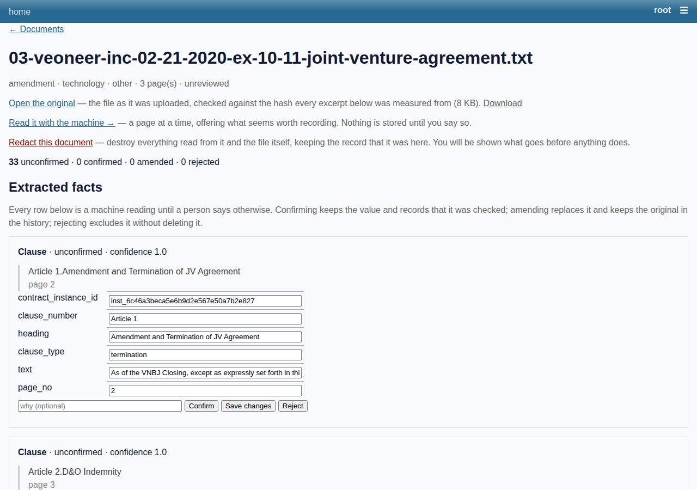

# Orpheus

**Point it at a folder of documents. Get back a set of facts you can query,
where every fact links to the sentence it came from and says whether a person
has checked it.**

Built for public servants who have four hundred contracts, or ten years of
minutes, and need to answer questions about them without reading all of them —
and without a tool that sounds confident when it is guessing.



*A real SEC contract exhibit, read by a model and shown as it comes out: every
row is `unconfirmed` until a person says otherwise, every row carries the
sentence it came from and the page it is on, and the original file is one click
away — checked against the hash every excerpt was measured from.*

---

## What you get

Point it at eight commercial contracts and you get, with no configuration:

- **Structured facts** — parties, dates, amounts, obligations, clauses — each
  with the excerpt it came from, the page it is on, and a status of
  `unconfirmed` until somebody says otherwise.
- **A wiki**: one page per company and person, gathering every mention across
  every document, with the sources listed underneath.
- **A relation graph** — who supplies whom, who signed what — projected up from
  individual mentions to those pages, [as a list or drawn](docs/user-guide.md#the-same-graph-drawn).
- **A chat that answers from the store**, not from the page: ask who the parties
  are and it tells you, and tells you whether anybody has confirmed them.
  [What that looks like](docs/user-guide.md#asking-about-the-page-you-are-on).
- **A calendar** of what expires, renews or falls due, and what is already past.
- **An adversarial pass** that hunts for the ways the store could be misleading
  you: quotations that are not in the document, pages asserting things no
  document says, conflicts smoothed into agreement.
- **The original file back**, checked byte for byte against the hash recorded
  when it was ingested.

All of it in one SQLite file you can copy, and a browser UI that runs on top of
it.

## Try it

```bash
pip install -e '.[server]'

orpheus --db data/orpheus.sqlite init --admin "Ada"
orpheus --db data/orpheus.sqlite ingest contract.pdf --actor-id act_… --extract
```

`init` prints the command that serves what it just built:

```bash
datasette serve data/orpheus.sqlite \
  --metadata config/metadata.yml --config config/datasette.yml \
  --plugins-dir plugins --template-dir templates --port 8001
```

Open `/-/orpheus`. Upload, review row by row, read a document a passage at a
time, browse the wiki and the graph. The same routes are JSON under
`/-/orpheus/api/`, and everything the browser can do the CLI can do.

Or `cd deploy && docker compose up -d`, which runs that plus Ollama.

**The [user guide](docs/user-guide.md) walks two real corpora end to end with
screenshots** — eight SEC contract exhibits, and sixteen governance minutes for
which no ontology existed until the machine proposed one.

---

## It is not only for contracts

The shipped ontology describes public-sector contracts. That is a JSON file, not
code: a bundle describing planning applications, inspection reports or grant
awards runs the same pipeline with nothing recompiled.

And when there is no bundle for your documents, `orpheus ontology survey` reads
a sample and proposes one — object types, properties and links, each with
quotations and a count of how many documents show it. It **writes no bundle**. A
person goes through the queue and `orpheus ontology draft` assembles one out of
what they accepted. The machine is good at noticing that something recurs and
bad at deciding whether two of them are one type with a role; a wrong extraction
is one row to amend, and a wrong object type is every row that will ever be
filed under it.

The guide's second case is exactly this, on Python Steering Council minutes.

---

## What it will not do

Worth knowing before you start, because these are deliberate:

- **It will not tell you a corpus is sound.** Every summary that could read as
  an all-clear is qualified with what it did not check.
- **It will not turn a machine reading into a fact.** Nothing is confirmed
  without a person, and every screen says which state a row is in.
- **It will not pick a winner between disagreeing documents.** Both are shown.
- **It will not ask a model how confident it is.** Confidence is computed from
  whether the excerpt is really in the document, not from the model's opinion of
  itself.
- **It does not do conflict-of-interest findings.** The store has no notion of
  ownership, directorships or donations, and a graph join is not an accusation.
  What it offers instead is `orpheus questions`: here is a chain, and here is
  how much of it anybody has checked.

---

## Four commitments, if you are reading the code

**Nothing is destructively overwritten.** Corrections insert into `edit_history`
and update the row's status; rejected rows are excluded, never deleted. That is
both the audit story and the only way to measure whether extraction is
improving. [Provenance and amendment](docs/provenance-and-amendment.md).

**Disagreement is a finding, not a defect.** Two confirmed extractions that
contradict each other are usually both right about the moment each document was
written. Rendered one under the other in the same voice they read as agreement,
so a verified conflict gets its own record, its own state and the top of the
page. [Conflicts and lint](docs/conflicts-and-lint.md).

**Datasette is the writer, and the core is a library it imports.** SQLite
permits one writer, and with several concurrent users that is a real constraint.
There is one process: the plugin calls `orpheus.api.handle()` on Datasette's own
write thread. No SQL is written in the plugin.
[Deployment](docs/deployment.md).

**Do not serve the store with `--immutable`.** It is the obvious flag for a
database you think nothing writes to, and with WAL mode it silently shows a site
missing rows.
[Why](docs/deployment.md#the-wal-and-immutable-mode-trap).

---

## Status

995 tests, no third-party dependencies in the core.

```bash
pip install -e '.[dev]'
python3 -m pytest
```

Every extraction engine, the PDF backends and OCR are optional installs, and the
code names the missing one when you reach for it.

The unit suite calls the core directly, which cannot catch what only breaks with
a real server in the middle — so `tests/e2e/browser_loop.sh` drives the whole
loop over HTTP against a live Datasette and checks the store agrees with what
the browser was told.

**Real models have run against real corpora**, and most of what is worth knowing
came from that rather than from the suite:

| Corpus | Documents | What it was for |
|---|---|---|
| SEC contract exhibits (CUAD) | 40 | The bundle this ships. Every quotation the model claimed was located in its document |
| Python Enhancement Proposals | 40 | A second domain, with a documented ontology to score a survey against |
| Steering Council minutes | 48 | Narrative prose with no structure at all for the pattern pass to read |

See [the corpus run](docs/corpus-run.md) for what each found, including the
defects, which is most of the value.

**What is still open is the human half.** Extraction quality is measured by
comparing what a person decided against what the machine said, and nobody has
reviewed a corpus yet: `orpheus report` correctly answers
`insufficient_evidence`. That number needs a reviewer, not a bigger corpus.
[Open decisions](docs/open-decisions.md).

---

## Documentation

Start with the **[user guide](docs/user-guide.md)**. Everything else is indexed
at [docs/index.md](docs/index.md):

| | |
|---|---|
| [User guide](docs/user-guide.md) | Two worked cases, photographed as they came out |
| [Data model](docs/data-model.md) | Tables, the ontology bundle, the confidence rubric |
| [Pipeline walkthrough](docs/pipeline-walkthrough.md) | The nine steps, with the function that runs each |
| [Entities: the wiki](docs/entities.md) | Mentions vs entities, and why a page is a projection |
| [Reading with the machine](docs/reading-companion.md) | A passage at a time, and why a suggestion is not an extraction |
| [Provenance and amendment](docs/provenance-and-amendment.md) | How a machine guess becomes a checked fact |
| [Conflicts and lint](docs/conflicts-and-lint.md) | The fourth review verb and the adversarial pass |
| [What falls due](docs/calendar.md) | The calendar, and the four things it refuses to do |
| [Network and corroboration](docs/network-and-corroboration.md) | The relation graph, and counting agreement honestly |
| [Questions the corpus raises](docs/questions.md) | Where the shape is worth asking about, and why none of it is a finding |
| [Where an ontology comes from](docs/ontology.md) | Surveying a corpus with no bundle |
| [Two different pasts](docs/two-pasts.md) | What was true then, and what we believed then |
| [Redaction](docs/redaction.md) | Taking a document out without breaking the audit trail |
| [Extraction engines](docs/extraction-engines.md) | Four ways to run the model pass, and when each is right |
| [API reference](docs/api-reference.md) | Routes, permissions, response shapes |
| [Deployment](docs/deployment.md) | Running it, and the WAL trap that catches people |
| [Developer guide](docs/developer-guide.md) | Setup, tests, troubleshooting |
| [The corpus run](docs/corpus-run.md) | What real models on real corpora found |
| [Open decisions](docs/open-decisions.md) | What is still undecided, and what the build corrected |
| [Prior art](docs/prior-art.md) | Open-source tools that already do parts of this |
| [OCDS alignment](docs/ocds-alignment.md) | Mapping the contract bundle onto the Open Contracting Data Standard |
| [Datasette ecosystem](docs/datasette-ecosystem.md) | Which plugins are worth adopting |

An agent working with a store should read `.claude/skills/orpheus/SKILL.md`
first. Its load-bearing rule is *never assert something the store does not hold,
and never assert it more firmly than the store does.*
