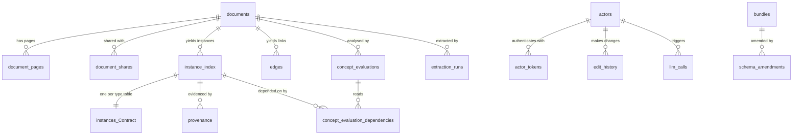

← [Back to index](index.md)

# Data model

Everything Orpheus knows lives in one SQLite file. This page is the reference
for what is in it, why each table exists, and the two vocabularies —
the confidence rubric and the review statuses — that every AI-sourced row
carries.

---

## The ontology bundle is the schema

Instance tables are not hand-written. They are generated from an **ontology
bundle**: a JSON document listing object types, their properties, link types,
and seed concept definitions. The shipped bundle is
`orpheus/bundles/contract-core-0.5.0.json`, and it is replaceable wholesale by
the output of a discovery run over a real corpus.

`bundle.apply_schema()` turns the bundle into DDL: one table per managed
object type, one column per declared property. It is idempotent, and it adds
columns the bundle has gained since — which is what makes accepting a schema
amendment a live operation rather than a redeployment.

### One spelling, and a format other tools already read

The bundle is an
[ontologySpecR](https://github.com/CathalByrneGit/ontologySpecR) bundle:
camelCase, `objects` / `links` / `interfaces` / `actions` / `queries`, and
vendor concerns under `extensions`. It is validated against that project's
schema **unmodified**, alongside Orpheus's own — so a bundle written for any
tool that speaks the format registers here without translation, and one written
here is readable by tools that know nothing about Orpheus.

That is a change worth naming. The earlier bundle carried **every list twice**,
once per consuming R package, because three of them spelled the same ideas
differently (`objects` / `object_types`, `primaryKey` / `primary_key`,
`concept_defs` / `concepts`). Validation existed mainly to check the duplicated
pairs agreed. Dropping the duplicates halved the file — 114 KB to 58 KB — and
removed a whole class of bug: a bundle cannot disagree with itself if it only
says each thing once. `tests/fixtures/contract-core-0.1.0.json` keeps the old
shape, because the loader still has to read it for anyone holding a store built
by it.

`bundle.validate()` runs both schemas and then the checks a schema cannot make:
that an object type implementing an interface really carries the interface's
properties, and that the domain block names types that exist. Those are the
failures that surface weeks later as fewer rows rather than as an error.

### Object types

| Type | Table | What it holds |
|---|---|---|
| `Contract` | `instances_Contract` | The agreement: name, reference, value, dates, procedure, governing law |
| `Company` | `instances_Company` | A legal entity party to or named in the agreement, including public bodies |
| `Person` | `instances_Person` | A named individual |
| `Clause` | `instances_Clause` | A numbered or titled provision |
| `Obligation` | `instances_Obligation` | A duty a clause places on a party |
| `Flag` | `instances_Flag` | An issue raised against a document or clause |
| `KeyDate` | `instances_KeyDate` | A date found in the text, with the phrase that introduced it |
| `MonetaryAmount` | `instances_MonetaryAmount` | A monetary value found in the text |
| `Relationship` | `edges` | An extracted link between two instances |

`KeyDate` and `MonetaryAmount` exist so the deterministic pass has somewhere to
write a finding with its own page-level provenance, rather than overwriting a
`Contract` property a model also populated. Two independent readings of the same
fact stay visible as two rows.

`Relationship` is backed by the hand-written `edges` table and marked
`extensions.orpheus.managed = false`, so schema generation leaves it alone. It
exists as an object type because links are traversed by joining object tables on
key columns — a many-to-many link cannot be traversed in one hop, but it can be
reached in two through the edge itself.

### The domain block

Three or four lines that keep the engine domain-neutral. Without them the
pipeline would have to hardcode `Contract`, and would become a contracts-only
tool the first time it needed to attach a date to something.

```json
"extensions": {
  "orpheus": {
    "domain": {
      "primaryObjectType":  "Contract",
      "containerProperty":  "contract_instance_id",
      "valueProperty":      "value_amount",
      "currencyProperty":   "value_currency",
      "documentTypes":      ["contract", "amendment", "tender",
                             "correspondence", "other"]
    }
  }
}
```

| Field | What reads it |
|---|---|
| `primaryObjectType` | Deterministic findings attach to it; corpus comparison anchors on it |
| `containerProperty` | The property on child types pointing back at that instance |
| `valueProperty`, `currencyProperty` | The corpus value comparison. Omit both and it reports itself unavailable |
| `documentTypes` | The classifier's vocabulary |
| `sectors`, `jurisdictions` | The classifier's vocabulary for those two fields. **Optional, and absent means the classifier does not ask.** Both were open questions until measured: `sector` produced thirteen spellings of one answer across forty-eight documents, and `jurisdiction` answered with an organisation |
| `flagObjectType` | Where a rule finding is written. Optional — a domain with no flag type still evaluates its concepts and records them, it just has nowhere to raise an instance |

It lives under `extensions` because that is where the spec puts vendor
concerns — which is what keeps the same file valid for a tool that has never
heard of Orpheus.

Validated at registration: a `primary_object_type` that is not an object type,
or a `value_property` that is not one of its properties, is rejected. A typo
there would disable a pipeline stage silently — findings would simply stop being
linked — which is the kind of failure that goes unnoticed for a long time.

`primaryObjectType` is required of any bundle that **has** object types, and of
no other. A bundle with none is the legitimate starting state of a corpus
nobody has modelled yet — there is nothing for a document to be fundamentally
about — and the JSON schema used to call that invalid. `starter-0.1.0.json` is
that bundle; `orpheus ontology survey` is how it stops being empty. See
[Where an ontology comes from](ontology.md).

### Interfaces: asking one question across several types

An interface is a contract several object types share, so a question spans them
without the list of types being written at the call site — which is how a new
object type silently stops being included in an answer.

| Interface | Implemented by | The question it answers |
|---|---|---|
| `Reviewable` | every extracted type | "What has not been checked yet?" |
| `Named` | `Company`, `Person`, `Contract` | "Does this name appear anywhere else?" |
| `DocumentScoped` | `Contract` | "Is this name an identifier, or just a title?" |
| `PageAnchored` | `Clause`, `KeyDate`, `MonetaryAmount` | "What can I point at on this page?" |

```python
>>> object_set_by_interface(store, "Named")
[{"instance_id": "inst_8e00…", "document_id": "doc_45ee…",
  "name": "Meridian Systems Ltd", "naive_key": "meridian systems",
  "status": "unconfirmed", "type_id": "Company"},
 {"instance_id": "inst_0463…", "document_id": "doc_45ee…",
  "name": "Aoife Nolan", "naive_key": "aoife nolan",
  "status": "unconfirmed", "type_id": "Person"}]
```

Rows are projected to the interface's properties only, so every row has the
same shape whichever type it came from; `type_id` says which that was.
Type-specific properties (`role`, `job_title`) are deliberately not projected —
if a caller needs those it is asking a type question, not an interface one.

`bundle.validate()` refuses a bundle where a type declares an interface it
cannot satisfy. An unchecked interface is worse than none: the cross-type query
would fail at runtime, or quietly return fewer rows than it should.

#### `DocumentScoped`: when a name is a title, not an identifier

`Named` carries an assumption that holds for a company and not for a contract:
that two documents using the same name are talking about the same thing. A
company name identifies a company. A contract name is a *title* — in the
calibration corpus three pairs of unrelated agreements are each called
"STRATEGIC ALLIANCE AGREEMENT", years and jurisdictions apart.

`DocumentScoped` says so. A type carrying it is identified by **the document it
was read from together with its name**: the name separates things inside one
document, and the document bounds how far the name reaches. So it gets a page
per contract per filing, and is never grouped, merged or matched across
documents by name.

The two halves both earn their place, and each was put there by a case the real
corpus produced:

- **Without the document**, "STRATEGIC ALLIANCE AGREEMENT" in two filings
  becomes one page — two agreements merged into one, with nothing left to
  notice it by.
- **Without the name**, one filing holding both "AMENDMENT NO. 1" and the
  "Wireless Content License Agreement Number 12965" it amends becomes one page
  — an amendment merged into the thing it changes.

A false merge is strictly worse than a false split. A split leaves two rows a
person can join; a merge leaves nothing. So where a contract genuinely does
appear in two filings this produces two pages, which is the safe direction and
the case `merge()` exists for.

It also changes what the machine is allowed to *offer*. `duplicate_pages()`
skips these types, and the corpus escalation leaves them out of its candidate
pool: for a title, an identical name is near-worthless evidence, and offering
it at a 100% score would misrepresent how good that evidence is.

`Relationship` implements nothing — it is an edge, not an extracted instance,
and its primary key is `edge_id`.

This is `ontologySpecR`'s `interfaces`, carried across. The corpus escalation
uses it: a
name is looked up across every `Named` type, so a name that is a company in one
document and a person in another is reported as a `cross_type_match` rather than
filtered out before anyone sees it.

### Every instance table has the same tail

| Column | Type | Meaning |
|---|---|---|
| `instance_id` | TEXT | Primary key |
| `document_id` | TEXT | Document this was extracted from |
| `source` | TEXT | `ai_local`, `ai_cloud`, or `human` |
| `confidence` | REAL | A rubric level — see below |
| `status` | TEXT | `unconfirmed`, `confirmed`, `amended`, `rejected` |
| `amended_by` | TEXT | Actor who last changed it |
| `amended_at` | TEXT | When |
| `created_at` | TEXT | Store bookkeeping, not a bundle property |

> **`provenance` is the immutable record; the instance row is the current one.**
> Amending an instance overwrites its `confidence` and `source` with the human's
> values, because after a correction the row is ground truth. The provenance row
> keeps what the machine originally claimed, which is what makes extraction
> quality measurable after people start correcting things.

`source`, `confidence` and `status` are declared as **bundle properties**, not
hidden metadata. An object set is projected down to declared
properties only, so a query that cannot see `status` cannot exclude rejected
rows — which would make every corpus-wide answer quietly wrong.

---

## The confidence rubric

Confidence is never an arbitrary float. It is one of five levels, so that "0.7"
means the same thing to every reviewer:

| Value | Label | Meaning |
|---|---|---|
| `1.0` | `explicit` | Stated verbatim and unambiguously |
| `0.9` | `named` | Clearly named with its attributes present |
| `0.7` | `implied` | Mentioned, with structure implied |
| `0.5` | `inferred` | Inferred from surrounding context |
| `0.2` | `speculative` | Speculative |

Extraction backends return arbitrary scores, so `snap_confidence()` snaps
every score to the nearest level **at the persistence boundary**, biased
downward: a score is promoted to a level only if it is at least that level. A
model's `0.83` is stored as `0.7`, never as `0.9`. A missing confidence becomes
`0.5` — inferred — rather than being treated as certain.

---

## Review statuses

| Status | Set by | Meaning |
|---|---|---|
| `unconfirmed` | extraction | No person has looked at this |
| `confirmed` | `confirm_instance()` | A person agrees with it as it stands |
| `amended` | `amend_instance()` | A person changed it; the previous value is in `edit_history` |
| `rejected` | `reject_instance()` | Excluded from downstream use, never deleted |

An engine that uses its own vocabulary — `pending`/`approved`, say — is
translated at the boundary in `engines.py`, so the store has one vocabulary
rather than two.

All four resolve towards a single answer standing, which is right for grading an
extraction and wrong for a corpus. **Tensions** are the second axis, and they
have their own vocabulary:

| Status | Meaning |
|---|---|
| `open` | Raised; nobody has ruled |
| `accepted` | A person looked, and the conflict is real — a *finished* review |
| `resolved` | Settled; `resolution` is required and says how |
| `withdrawn` | Not a real conflict; kept as evidence about detection |

A tension is not uncertainty — `confidence` is that axis. It is a conflict
somebody verified. See [Conflicts and lint](conflicts-and-lint.md).

---

## Tables

### Documents and text

| Table | Purpose |
|---|---|
| `documents` | One row per ingested file: hash, storage path, classification, visibility, document-level `review_status` |
| `document_pages` | One row per page: `text`, `text_source` (`native` / `ocr` / `needs_ocr`), `image_path`, `char_count` |
| `document_shares` | Per-actor share grants: `role` is `viewer` or `editor` |

`documents.file_hash` carries a unique index: dedup is on content, so the same
contract mailed round twice under different names is one document.

### Instances and links

| Table | Purpose |
|---|---|
| `instances_*` | One table per object type, generated from the bundle |
| `instance_index` | `instance_id → type_id, table_name, document_id`. The type-agnostic handle: makes "find this instance" one lookup instead of a scan across every type table |
| `edges` | Extracted relationships, with the same provenance tail as instances |
| `provenance` | `instance_id, document_id, source_label, page_no, excerpt, confidence, source` — where each fact came from, and what the machine claimed at the time |

### Interpretation

| Table | Purpose |
|---|---|
| `concept_evaluations` | Rule results, narrative analyses and corpus comparisons, distinguished by `kind` |
| `concept_evaluation_dependencies` | Which instances an evaluation read — this is what makes `stale` automatic |
| `concept_definitions`, `concept_versions` | Versioned rule concepts: the SQL and its history |

`concept_evaluations` carries `scope` (`document` or `database`),
`resolution_quality` (set to `naive_unresolved` for corpus results),
`corpus_context_used`, and `stale` with a `stale_reason`.

### Conflicts

| Table | Purpose |
|---|---|
| `tensions` | One verified conflict: `scope`, `subject_id`, `kind`, `property_id`, `summary`, `status`, `resolution` |
| `tension_sides` | The cited sides: `instance_id`, `document_id`, `position` |

A tension carries **at least two sides**, each an instance with provenance,
enforced in `tensions.py`. The same rule as the entity page and for the same
reason: without it, a tension is an unfalsifiable opinion, and one of those in a
store built on citations is the single row nobody can check.

`kind` is one of `conflicting_value`, `competing_authority`, `ambiguous_wording`
or `unexplained` — deliberately about the *shape* of a disagreement rather than
about contracts, so another domain describes its conflicts in the same words.

### Audit

| Table | Purpose |
|---|---|
| `edit_history` | Append-only. Every change, with `previous_value` and `new_value` as JSON |
| `llm_calls` | Every model call: tier, model, purpose, prompt size, payload digest, and any error |
| `schema_amendments` | Properties and types seen during population but not in the bundle |
| `extraction_runs` | One row per extraction attempt, including failures |
| `ontology_candidates` | Object types, properties and links a survey proposed for a corpus with no bundle |
| `ontology_evidence` | The quotations behind each candidate, located by `align.py` |

`ontology_candidates` is deliberately not `schema_amendments`. An amendment is a
correction to an ontology already in force with rows already filed under it, so
accepting one is a patch bump; a candidate is a proposal about a corpus with no
ontology at all. One queue holding both would mean a reviewer could not tell
which question they were being asked.

Both `edit_history` and `llm_calls` carry a `seq INTEGER PRIMARY KEY
AUTOINCREMENT`. Ordering is by `seq`, never by timestamp: several changes inside
one transaction share a timestamp to the second, and an audit trail that
reports them in an arbitrary order cannot answer the question it exists for.

### Identity and configuration

| Table | Purpose |
|---|---|
| `actors` | Authenticated users and API agents, with `departments_json` and `is_admin` |
| `actor_tokens` | Bearer tokens, stored as SHA-256 hashes only |
| `bundles` | Every registered bundle version, with `stage` and `is_active` |
| `org_settings` | Deployment settings, notably `cloud_ai_policy` and `cloud_send_mode` |

---

## How it fits together



---

[← Back to index](index.md) | [Next: Pipeline walkthrough →](pipeline-walkthrough.md)
