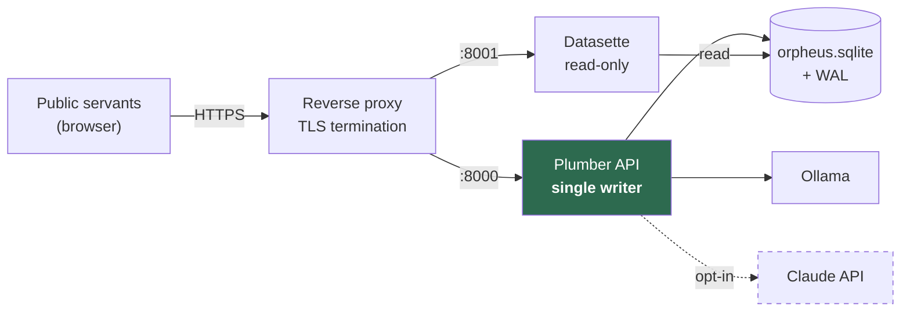

← [Back to index](index.md)

# Deployment

Two services on one host: the Plumber API (the single writer) and Datasette
(read-only browsing). Both sit behind a reverse proxy that terminates TLS.



Neither service should be exposed directly. `plumb.R` binds `127.0.0.1` by
default for exactly that reason.

---

## Environment

| Variable | Default | Purpose |
|---|---|---|
| `ORPHEUS_DB` | `data/orpheus.sqlite` | Store path |
| `ORPHEUS_STORAGE` | `storage` | Originals and page images |
| `ORPHEUS_HOST` | `127.0.0.1` | API bind address |
| `ORPHEUS_PORT` | `8000` | API port |
| `ORPHEUS_FORCE_LOCK` | unset | `1` takes over a lock left by a crashed writer |
| `ORPHEUS_LOCAL_MODEL` | `llama3.1:8b` | Ollama model |
| `ORPHEUS_OLLAMA_HOST` | `http://localhost:11434` | Ollama endpoint |
| `ORPHEUS_CLOUD_MODEL` | `claude-sonnet-4-20250514` | Cloud model |
| `ANTHROPIC_API_KEY` | — | Only needed if cloud is enabled |

---

## Running it

```bash
# Writer
ORPHEUS_DB=/srv/orpheus/data/orpheus.sqlite \
ORPHEUS_STORAGE=/srv/orpheus/storage \
  Rscript inst/plumber/plumb.R

# Reader
datasette serve /srv/orpheus/data/orpheus.sqlite \
  --metadata inst/datasette/metadata.yml --port 8001 \
  --setting sql_time_limit_ms 3000 --setting max_returned_rows 2000
```

`orph_datasette_command()` generates that second line, so it cannot drift from
what the code expects.

---

## The WAL and immutable-mode trap

**Do not serve the live store with `--immutable`.** It is the obvious flag for a
database Datasette never writes to, and it will silently show an empty site.

The architecture requires WAL mode so readers are not blocked by the writer.
With WAL, committed data lives in the `-wal` sidecar until a checkpoint folds it
back into the main file. `--immutable` sets SQLite's `immutable=1`, which tells
SQLite the file cannot change and lets it **skip the WAL entirely**. On a live
store, an immutable reader therefore sees the database as of the last
checkpoint — and on a freshly written one, that is nothing at all.

Measured on this store during the build:

| Reader | Rows visible |
|---|---|
| `immutable=1`, WAL not checkpointed | **0 documents** |
| `mode=ro`, WAL present | 1 document |
| `immutable=1`, after `wal_checkpoint(TRUNCATE)` | 1 document |

No error is raised in the first case. The pages load; they are just empty.

Two mitigations are in place:

1. **Serve read-only, not immutable.** Datasette core never writes to an
   attached database, and the single-writer lock stops a second writer
   regardless, so the flag buys nothing here.
2. **The API checkpoints after every write.** A `postroute` hook calls
   `orph_checkpoint()` on any non-`GET` request, and `orph_checkpoint(con,
   "TRUNCATE")` runs on exit. This keeps the main file current for any reader,
   including backups, and stops the WAL growing without bound — it reached
   ~1 MB against a 368 KB database in testing before this was added.

`--immutable` is correct for one case only: a snapshot that has been
checkpointed and is no longer being written to. `orph_datasette_command(immutable
= TRUE)` generates that variant.

---

## The other Datasette gotcha: the database name

Datasette derives a database's name from its **filename stem** and matches
metadata keys against it. Serving `contracts.sqlite` against metadata declaring a
database called `orpheus` silently drops every canned query and table
description — the pages still load, they just lose their configuration.

The file must be named `orpheus.sqlite`, or the metadata key changed to match.
`orph_datasette_naming_note()` states this; it was found the hard way.

---

## The Datasette UI plugin

`plugins/orpheus_datasette.py` adds an upload page and per-row review actions,
so a person can drop a document in and correct what came out without leaving
Datasette.

```bash
datasette serve data/orpheus.sqlite \
  --plugins-dir plugins --template-dir templates \
  --metadata datasette.yml --port 8001
```

```yaml
# datasette.yml
plugins:
  orpheus-datasette:
    api_url: "http://127.0.0.1:8000"
    actor_tokens:
      "nuala@dept.ie": "…"     # per-actor: amendments name the real person
    # token: "…"               # single shared token: fine for one user, and
                               # then every amendment is attributed to one id
```

| Route | What it does |
|---|---|
| `/-/orpheus` | Documents, deployment capabilities, and the upload form |
| `/-/orpheus/upload` | Ingest → classify → extract, via the API |
| `/-/orpheus/document/<id>` | Extracted facts with their excerpts, editable |
| `/-/orpheus/review` | Confirm, amend or reject one instance |

### Two constraints it is built around

**It never opens a SQLite connection.** Datasette writing to the store directly
would make it a second writer and the storage design would stop holding. Verified
rather than asserted: with the UI running and documents ingested through it, the
writer lock is held by the API process, and the plugin contains no
`execute_write` and no `sqlite3` call.

**It never calls a model.** Doing so would bypass the cloud opt-in gate, the org
policy, the per-request consent and the `llm_calls` audit in one step. Selecting
the cloud tier in the upload form on a deployment with `cloud_ai_policy =
disabled` returns the API's own refusal — surfaced verbatim, because the API's
errors are written for a person — and the cloud audit log stays empty.

Everything the plugin does therefore passes through the API, which applies
provenance, the confidence rubric, the amendment history and permissions on the
way in. It is a client, and deliberately a thin one.

### What it is not yet

Upload takes a **server-side path**, not a browser file upload — enough to
exercise the loop, and it is also how a watched drop-directory would feed the
same code path. There is no live annotation as you read; that is the reading
companion, and it is a later phase.

---

## Backups

Copy **the database and its `-wal` sidecar together**, or checkpoint first.
Copying `orpheus.sqlite` alone from a WAL-mode store loses every commit still in
the WAL — the same failure as the `--immutable` trap, in a form that is much
worse because it is silent and permanent.

```bash
# Safe: checkpoint, then copy the single file
sqlite3 /srv/orpheus/data/orpheus.sqlite 'PRAGMA wal_checkpoint(TRUNCATE);'
cp /srv/orpheus/data/orpheus.sqlite /backup/orpheus-$(date +%F).sqlite

# Also safe, and does not need the writer to cooperate
sqlite3 /srv/orpheus/data/orpheus.sqlite ".backup '/backup/orpheus-$(date +%F).sqlite'"
```

`storage/` must be backed up too — it holds the originals every extraction is
derived from.

---

## The single-writer lock

`orph_connect(mode = "write")` writes `orpheus.sqlite.writer.lock` recording the
owning process. A second writer fails at startup with a message naming the
holding pid, rather than becoming a silent second writer.

If a writer crashes, the lock remains and its process is gone. The next start
detects that and refuses with instructions; `ORPHEUS_FORCE_LOCK=1` takes over.
Do this only when you have confirmed no other writer is running — the lock is
the only thing enforcing the constraint the storage design depends on.

---

## Identity provider

Actors reach the store through `orph_upsert_actor(con, idp, external_id, ...)`,
which is the bridge from whichever provider the deployment settles on. Entra ID,
Okta, a government SSO and GitHub OAuth all arrive at the same place: an `idp`
and an `external_id`.

Which provider to use is [an open decision](open-decisions.md#identity-provider).
Until it is made, API tokens (`orph_create_token()`) are the working path — they
are hashed with SHA-256 and only ever shown once.

For Datasette, the matching plugin depends on the same choice, and per-document
row filtering needs a plugin implementing `permission_resources_sql`. The SQL
that hook needs is generated by `orph_permission_sql()` and embedded as a comment
in `inst/datasette/metadata.yml`. Regenerate it with
`orph_write_datasette_metadata()` after any change to the permission model.

---

## Hosting

Self-hosted, on-premises or in a government-approved environment. TLS is
required. Data residency should be confirmed before choosing a host — this store
holds contract documents and the audit trail of who read and changed them.

Do not use a public `datasette publish` target without review.

---

[← Back to index](index.md) | [Next: Developer guide →](developer-guide.md)
