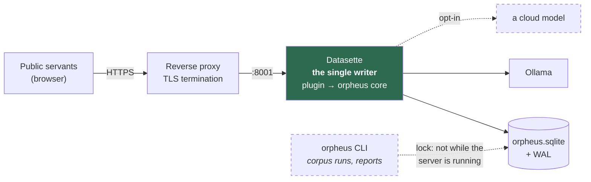

← [Back to index](index.md)

# Deployment

One service, behind a reverse proxy that terminates TLS. Datasette is the
writer; the core is a library it imports.



There was a second service here — a Plumber API that owned the only write
connection, with Datasette mounted read-only beside it so the container runtime
enforced the rule. Both halves are gone. What replaces the enforcement is not
weaker: **nothing writes except through `orpheus` core functions**, and every
one of those runs on Datasette's own write thread, which serialises them.

The service should not be exposed directly; it binds `127.0.0.1` in compose for
exactly that reason.

---

## Environment

| Variable | Default | Purpose |
|---|---|---|
| `ORPHEUS_DB` | `data/orpheus.sqlite` | Store path |
| `ORPHEUS_STORAGE` | `storage` | Originals and page images |
| `ORPHEUS_LOCAL_MODEL` | `llama3.1:8b` | Ollama model |
| `ORPHEUS_OLLAMA_HOST` | `http://localhost:11434` | Ollama endpoint |
| `ORPHEUS_CLOUD_MODEL` | — | Cloud model, when one is enabled |
| `ANTHROPIC_API_KEY` / `GEMINI_API_KEY` | — | Only read if cloud is enabled |
| `DATASETTE_SECRET` | — | Signs the session cookie; without a fixed value every restart signs everyone out |

The writer lock is taken over with `--force-lock` on the CLI rather than an
environment variable, so it is a decision made per command rather than one left
set in a shell.

---

## Running it

```bash
orpheus --db /srv/orpheus/data/orpheus.sqlite init \
  --admin "Your Name" --storage-root /srv/orpheus/storage

datasette serve /srv/orpheus/data/orpheus.sqlite \
  --metadata config/metadata.yml \
  --config   config/datasette.yml \
  --plugins-dir plugins --template-dir templates --port 8001 \
  --setting sql_time_limit_ms 3000 --setting max_returned_rows 2000
```

`init` prints that second command, and `orpheus serve --print-only` regenerates
it, so it cannot drift from what the code expects. `--no-ui` gives a reader with
no upload page.

**`init` and the server cannot run at once.** The CLI opens the store the
ordinary way and takes the advisory writer lock; against a live server it is
refused, which is the lock doing its job rather than a problem to work around.
The same applies to `ingest`. `report` opens read-only and takes no lock, so it
runs against a live server.

### Two YAML files, and they are not interchangeable

Both are generated by `orpheus config` from the bundle and the permission model,
so they cannot disagree with either. The canned queries come from the bundle
too, not from the code — a planning-application bundle ships its own questions
rather than inheriting a fixed set of contract-flavoured ones. Datasette reads them
through different paths:

| File | Flag | Carries |
|---|---|---|
| `metadata.yml` | `--metadata` | Title, description, table descriptions — the only file that reaches the rendered pages |
| `datasette.yml` | `--config` | `allow` blocks, canned queries, UI plugin settings |

Moving content between them fails in both directions, and only one of the two
failures is loud: a canned query left in the metadata file loses its `sql` on
the way through and Datasette 1.0 dies at startup with `KeyError: 'sql'`, while
a table description put in the config file renders nothing at all and says
nothing about it.

---

## The WAL and immutable-mode trap

**Do not serve the live store with `--immutable`.** It is the obvious flag for a
database Datasette never writes to, and it will silently show an empty site.

The architecture requires WAL mode so readers are not blocked by the writer.
With WAL, committed data lives in the `-wal` sidecar until a checkpoint folds it
back into the main file. `--immutable` sets SQLite's `immutable=1`, which tells
SQLite the file cannot change and lets it **skip the WAL entirely**. On a live
store, an immutable reader therefore sees the database as of the last
checkpoint — and on a freshly written one, that is nothing at all.

Measured on this store during the build:

| Reader | Rows visible |
|---|---|
| `immutable=1`, WAL not checkpointed | **0 documents** |
| `mode=ro`, WAL present | 1 document |
| `immutable=1`, after `wal_checkpoint(TRUNCATE)` | 1 document |

No error is raised in the first case. The pages load; they are just empty.

Two mitigations are in place:

1. **Serve read-only, not immutable.** Datasette core never writes to an
   attached database, and the single-writer lock stops a second writer
   regardless, so the flag buys nothing here.
2. **The store checkpoints after writes.** `Store.checkpoint()` folds the WAL
   back into the main file, which keeps it current for any other reader —
   including a backup that copies the `.sqlite` alone — and stops the WAL
   growing without bound. It reached ~1 MB against a 368 KB database in testing
   before this was added.

`--immutable` is correct for one case only: a snapshot that has been
checkpointed and is no longer being written to. `orpheus serve --print-only`
does not generate that variant by default; pass `immutable=True` to
`serve_command()` if you are serving a snapshot.

---

## The other Datasette gotcha: the database name

Datasette derives a database's name from its **filename stem** and matches
metadata keys against it. Serving `contracts.sqlite` against metadata declaring a
database called `orpheus` silently drops every canned query and table
description — the pages still load, they just lose their configuration.

The file must be named `orpheus.sqlite`, or the metadata key changed to match.
It was found the hard way.

---

## The Datasette UI plugin

`plugins/orpheus_datasette.py` adds an upload page and per-row review actions,
so a person can drop a document in and correct what came out without leaving
Datasette.

Its settings are the `plugins` block of the generated `datasette.yml`:

```yaml
plugins:
  orpheus-datasette:
    database: "orpheus"        # which attached database holds the store
    storage_root: "storage"    # where ingest puts originals and page images
    max_file_size: 52428800    # per-file ceiling on browser uploads (50MB default)
    actor_map:                 # Datasette actor id -> Orpheus actor id
      "github|12345": act_1f2e3d...
```

There is no base URL and no token, because the plugin is already inside the
process that holds the database. What it needs to be told is which database and
where to put files.

`actor_map` is the seam between the two identity models: Datasette answers *who
is this*, Orpheus answers *what may they see*. Without a mapping, edits are
attributed to the Datasette actor id verbatim, which will not match a row in
`actors`.

Browser file upload needs **Datasette 1.0a32 or newer** — `Request.form(files=True)`
does not exist before it. On an older Datasette the rest of the plugin still
works and the file input reports that it needs a newer server.

| Route | What it does |
|---|---|
| `/-/orpheus` | Documents, deployment capabilities, and the upload form |
| `/-/orpheus/upload` | Ingest → classify → extract |
| `/-/orpheus/document/<id>` | Extracted facts with their excerpts, editable |
| `/-/orpheus/review` | Confirm, amend or reject one instance |
| `/-/orpheus/api/...` | The same dispatch table, as JSON |

### Two constraints it is built around

**It writes no SQL.** The R plugin's invariant was "it never opens a SQLite
connection", because opening one would have made a second writer. Here it is
handed Datasette's own connection, so the invariant is different and stricter:
every write goes through `api.handle()`, which applies provenance, the
confidence rubric, the amendment history and per-document permissions on the way
in. Grep the file for `INSERT` or `UPDATE` — there is nothing to find.

Two consequences worth knowing, both learned by running it:

- `execute_write_fn` wraps each task in `BEGIN IMMEDIATE`, so the store joins
  that transaction rather than starting one (`Store.adopt(owns_transaction=False)`).
- Because that queue commits when the task *returns*, a failed write has to be
  **raised**. `api.handle()` turns core exceptions into `(4xx, {"error": ...})`,
  which was right over HTTP where the connection had already rolled back; here,
  returning normally is the instruction to commit, so a half-done ingest would
  have been committed half-done. The plugin raises the status out and unwraps it
  on the far side.

**It never calls a model.** Doing so would bypass the cloud opt-in gate, the org
policy, the per-request consent and the `llm_calls` audit in one step. The tier
a person picks on the form is passed to the core, which decides. Selecting the
cloud tier on a deployment with `cloud_ai_policy = disabled` returns the core's
own refusal — surfaced verbatim, because those messages are written for a
person — and the cloud audit log stays empty.

### Upload takes a file or a path

The form accepts a **file chosen in the browser** and, separately, a
**server-side path** — the latter kept because it is how a watched
drop-directory would feed the same code path.

Parsing is Datasette's own `request.form(files=True)` rather than a hand-rolled
parser, which is what gives the upload its ceilings on file size, request size
and free disk. Those raise `BadRequest` — *not* the `MultipartParseError` the
name suggests, which is why the limit was silently unenforced once — so the
limit shows up on the form as *"Upload rejected: File too large"* rather than as
a bare 400 page. `tests/e2e/browser_loop.sh` posts a 60 MB file at the default
50 MB ceiling and asserts the redirect carries the rejection.

The uploaded bytes are written to a temp file before ingest, because ingest
hashes and content-addresses the original and needs a file to do it.

### What it is not yet

There is no live annotation as you read; that is the reading companion, and it
is a later phase.

---

## Backups

Copy **the database and its `-wal` sidecar together**, or checkpoint first.
Copying `orpheus.sqlite` alone from a WAL-mode store loses every commit still in
the WAL — the same failure as the `--immutable` trap, in a form that is much
worse because it is silent and permanent.

```bash
# Safe: checkpoint, then copy the single file
sqlite3 /srv/orpheus/data/orpheus.sqlite 'PRAGMA wal_checkpoint(TRUNCATE);'
cp /srv/orpheus/data/orpheus.sqlite /backup/orpheus-$(date +%F).sqlite

# Also safe, and does not need the writer to cooperate
sqlite3 /srv/orpheus/data/orpheus.sqlite ".backup '/backup/orpheus-$(date +%F).sqlite'"
```

`storage/` must be backed up too — it holds the originals every extraction is
derived from.

---

## The single-writer lock

`Store(path, mode="write")` writes a lock file recording the owning process. A
second writer fails at startup with a message naming the holding pid, rather
than becoming a silent second writer.

The lock guards against a second **process** — a CLI run, a script, a cron job —
while the server holds the store. Datasette itself does not take it:
`Store.adopt()` borrows the connection Datasette already opened, and is by
construction already inside the process that owns it.

If a writer crashes, the lock remains and its process is gone. The next start
detects that and refuses with instructions; `--force-lock` takes over. Do this
only when you have confirmed no other writer is running — the lock is the only
thing enforcing the constraint the storage design depends on.

---

## Identity provider

Actors reach the store through `auth.upsert_actor(store, idp, external_id, ...)`,
which is the bridge from whichever provider the deployment settles on. Entra ID,
Okta, a government SSO and GitHub OAuth all arrive at the same place: an `idp`
and an `external_id`.

Which provider to use is [an open decision](open-decisions.md#identity-provider).
Until it is made, two paths work. In the browser, any Datasette auth plugin —
`datasette-auth-passwords`, `datasette-auth-github`, an SSO plugin — supplies
the actor, and `actor_map` connects it to an Orpheus one. For scripts, API
tokens (`orpheus token <actor_id>`) are hashed with SHA-256 and only ever shown
once.

For Datasette, the matching plugin depends on the same choice, and per-document
row filtering needs a plugin implementing `permission_resources_sql`. The SQL
that hook needs is generated by `auth.permission_sql()` and embedded as a
comment in `config/datasette.yml`. Regenerate it with `orpheus config` after any
change to the permission model.

---

## Hosting

Self-hosted, on-premises or in a government-approved environment. TLS is
required. Data residency should be confirmed before choosing a host — this store
holds contract documents and the audit trail of who read and changed them.

Do not use a public `datasette publish` target without review.

---

[← Back to index](index.md) | [Next: Developer guide →](developer-guide.md)
