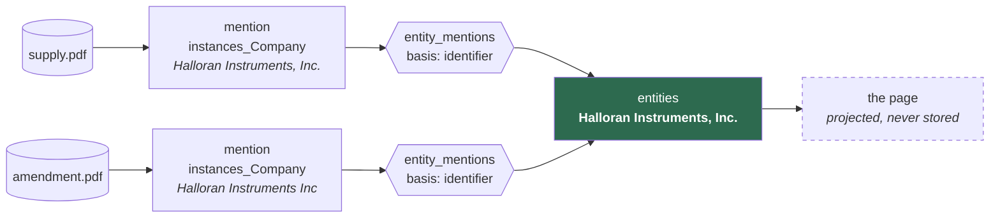

← [Back to index](index.md)

# Entities: the wiki

Everything up to this point was **mentions**. An `instances_Company` row is
document-scoped by construction: it records that *this document* named *this
company* at *this page*, with an excerpt and a review status. Two documents
naming one company are two rows, joined only by a key computed from the
spelling.

That is the right shape for "does this name appear elsewhere" and the wrong one
for "what do we know about this company" — which is the question a body of
knowledge has to answer if the next project is going to reuse it.

---

## An entity page is a projection, not a document



The page is computed from its mentions every time it is read. Nothing about a
company is stored on the entity row except its name and, optionally, prose a
person wrote. **So a claim with no mention behind it cannot appear on a page** —
not by convention, but because there is nowhere to put one.

That is the property that makes this reusable. A knowledge base of confident
uncited assertions is worth nothing downstream, and it is the default output of
every "AI builds you a wiki" tool. Here, every line points at a document, a
page, an excerpt, how well that excerpt matched the source, and whether a person
has checked it.

---

## Two tables

| Table | Holds |
|---|---|
| `entities` | The thing itself: `canonical_name`, `type_id`, a `description` a person wrote, review `status`, and `merged_into` |
| `entity_mentions` | Which mentions belong to it, on what `basis`, and whether a person has confirmed each link |

### `basis` is evidence, not a score

| Basis | What it means | Confidence |
|---|---|---|
| `human` | A person said so | `explicit` |
| `document` | The type is document-scoped, and this is its document | `explicit` |
| `identifier` | A stated registration number matched exactly | `named` |
| `naive_key` | A normalised name matched exactly | `implied` |
| `initials` | Two personal names agree on first and last, differing by a middle initial | `inferred` |
| `similar` | Names close but not equal after normalising | `inferred` |
| `search` | A full-text hit | `inferred` |

These are different **kinds** of claim, not points on one scale, and collapsing
them would lose the distinction permanently. An exact company number is better
evidence than any spelling, however close — so `propose_entities()` groups on
identifiers first and falls back to names.

`document` outranks `identifier` because it is not a match at all. For a
[document-scoped type](data-model.md#documentscoped-when-a-name-is-a-title-not-an-identifier)
the document *is* the identity, so the link is the rule rather than an inference
from it — and which document an instance was read from is recorded by ingest,
not extracted by a model that could get it wrong.

### `similar` catches what an exact key cannot

`naive_key` compares keys for **equality**, so a name that normalises
differently is invisible to it however obviously it is the same thing.
`"Ernst & Young"` and `"Ernst and Young"` is the documented case — the ampersand
becomes a space and the word does not, and no suffix rule fixes that.

`similar_names()` closes it with `rapidfuzz`, scoring `token_sort_ratio` over
lowercased names above a threshold of 80. That number is the midpoint of a
measured gap:

```
Halloran Instruments, Inc. / Halloran Instruments Inc   96.0  same
O'Sullivan Engineering     / OSullivan Engineering      97.7  same
MERIDIAN SYSTEMS LTD       / Meridian Systems Limited   90.9  same
Ernst & Young              / Ernst and Young            85.7  same
------------------------------------------------------- 80 --
Kestrel Medical Group      / Kestrel Medical Ltd        75.0  different
Kestrel Medical Group      / Kestrel Dental Group       63.4  different
CRH Group                  / CRH plc                    62.5  different
Halloran Instruments       / Halloran Group             47.1  different
```

Two things there had to be measured rather than assumed. **Case must be
normalised first** — on raw names that table overlaps catastrophically, with
`MERIDIAN SYSTEMS LTD` scoring 22.7 against its own expansion. And
**Jaro-Winkler is the wrong scorer**, despite being the obvious pick: it rates
`Kestrel Medical Group` against `Kestrel Medical Ltd` at 0.921, higher than
several true matches, so it would recreate the false merge that stripping
`group` as a suffix caused.

Ten hand-picked pairs is not a calibration. The threshold is a module setting
and a function argument for that reason, and it wants revisiting against a real
corpus.

It is optional (`pip install 'orpheus[match]'`). Without it, candidates come
from exact keys and stated identifiers only — which is what the rest of the
system rests on, so nothing breaks.

### The other half: two pages that are one thing

`similar_names()` helps a mention with no page. It cannot help the opposite
case, which is worse because it hides.

`propose_entities()` groups on exact keys, so `"Ernst & Young"` and `"Ernst and
Young"` become **two pages**. Every mention then has a home, so the review queue
is empty — the split is invisible exactly when the machine has finished its
work, and nothing prompts anyone to look.

`duplicate_pages()` closes that: same scorer, same threshold, run over the page
names rather than the mention names. It surfaces on the wiki's front page as
candidates for merging, with the page carrying more evidence offered as the
survivor. Found by running the thing, not by reasoning about it — a three-line
corpus produced four pages where three were right.

Neither function ever merges anything.

### What the 40-document run found, and what fixed it

The wiki rests almost entirely on the weakest basis there is: **178 of 180 pages
had nothing behind them but a normalised name**, because only 2 of 74 companies
stated a registration number. So how good the name rules are is not a detail.

Run against the real corpus, `duplicate_pages()` offered seven merges. Three
were right, one was arguable, and **three were wrong**:

```
90.9  Mitchell Felder        <-> Mitchell S. Felder     one man
88.2  Dr. Mitchell Felder    <-> Mitchell Felder        one man
81.1  Dr. Mitchell Felder    <-> Mitchell S. Felder     one man
89.3  HealthPlan Services    <-> Sykes HealthPlan Services
87.8  EFTC OPERATING CORP.   <-> K*TEC OPERATING CORP.  two companies
80.0  SUNTRON CORPORATION    <-> UTEK Corporation       two companies
80.0  Franchisee             <-> Franchisor             not names at all
```

Three separate defects, and each needed a different answer.

**A title is not part of a name.** "Dr. Mitchell Felder" and "Mitchell Felder"
were two keys and two pages for one man, holding two of his three relations
between them. `naive_key` now strips leading honorifics — but only for a
*personal* name, because doing it to every name takes the "Dr" out of "Dr
Pepper", and this function is matched on for equality, so a bad strip merges
silently. Which types have personal names is [the bundle's
business](data-model.md#interfaces-asking-one-question-across-several-types),
not the engine's.

**A spelling score is not a reason.** "Mitchell Felder" and "Mitchell S.
Felder" are 90.9% similar, which tells a reviewer nothing they can check. They
are now offered on their own basis — `initials`, "same first and last name,
differing by an initial" — ranked above `similar` because it is structural
rather than a character distance. It never merges: "John A. Smith" and "John B.
Smith" pass the first-and-last test and are two people, so contradicting
initials are refused outright, and even agreeing ones are only a candidate.

**Boilerplate carried the false matches.** Most of "EFTC OPERATING CORP." is
words every name in the corpus has. Corpus frequency does not separate them
either — in 74 company names, "operating" and "healthplan" both appear twice,
and only one of those pairs is real. What separates them is *which side carries
the difference*: a name that extends another is a candidate, and a pair where
each name has a distinctive word the other lacks is two things. `EFTC` against
`K*TEC`, `SUNTRON` against `UTEK`. A near-spelling does not count as
distinctive, so "Instruments"/"Instrument" survives — the boundary is measured,
at 0.85 on `difflib`'s ratio, with the numbers recorded beside the constant.

Result on the same corpus: **seven candidates became four**, the three wrong
ones gone and none of the right ones lost. The list now leads with the
strongest reason rather than the highest percentage:

```
naive_key  Dr. Mitchell Felder  <-> Mitchell Felder
           both filed under the name key 'mitchell felder'
initials   Mitchell Felder      <-> Mitchell S. Felder
           same first and last name, differing by an initial
similar    HealthPlan Services  <-> Sykes HealthPlan Services, Inc.
           names 89% similar
```

Two pages under one key is now its own basis, and it runs **without
rapidfuzz** — it is the same test `propose_entities` groups on, so calling it
"88% similar" described it as something weaker than it is, and it finds pairs
the fuzzy pass cannot see at all ("Foo Co Ltd" and "Foo" share a key and score
too low to be offered).

**The graph does not help here, and it was worth checking.** Resolving entities
by who they appear with is the obvious idea. Measured: EFTC and K\*TEC share a
document *and* a neighbouring page, and they are different companies — because
that is what a contract does, it names two different parties in one filing.
Co-occurrence is evidence of being different as often as of being the same.

### The loop: an agent gathers evidence, a person decides

Better rules narrow the candidate list; they cannot settle it. What settles a
pair is usually in the documents rather than in the columns, and reading four
contracts to decide whether two pages are one company is the part that does not
scale.

`resolution_evidence()` assembles everything the store holds bearing on a pair:
shared identifiers, shared property values, the name analysis, the weak signals
labelled weak, and the passages naming each. It has no verdict field. Two agent
tools sit on top — `orpheus_compare_pages` reads it, `orpheus_record_comparison`
writes down what was decided — and neither merges anything. `merge_entities()`
is still the only thing that does, and a person still calls it.

**A shared value is worth what its rarity says it is worth.** Both Felder pages
carry `acting_for = "Marv Enterprises, LLC"`, which 3 of 74 Person pages share.
"EFTC OPERATING CORP." and "K*TEC OPERATING CORP." both carry `entity_kind =
"private_company"`, which 64 of 74 Company pages share, and they are different
companies. Those look identical without the count, so every shared value comes
back with `n_pages_sharing` and its denominator, and the function draws no
conclusion from either.

Run against the corpus with a model reading the dossier:

| pair | recommended | on what |
|---|---|---|
| Mitchell Felder / Mitchell S. Felder | **same** | the rare `acting_for`, and a middle initial |
| EFTC OPERATING CORP. / K\*TEC OPERATING CORP. | **different** | distinct words either side; the only shared values are ones 13 and 64 pages carry |
| HealthPlan Services / Sykes HealthPlan Services | **different** | the passages: `HealthPlan Services, Inc. ("HPS")` and `Sykes HealthPlan Services, Inc. ("SHPS")` are two defined terms in one agreement |

The third is the one worth noting. Every rule in this document calls it
arguable — 89% similar, one name containing the other. What settles it is the
source text, and only reading the passages gets there.

**And a failure worth recording.** Asked to compare the second pair, a model
called them "both Delaware corporations". Nothing in the evidence says Delaware;
it was a plausible embellishment that would have read as a fact from the file.
The tool's steer now says so, with that example in it, and the recommendation is
checkable against the quoted passages precisely so a reviewer can catch the next
one.

### A register, when the documents cannot settle it

Some pairs the corpus cannot answer. Only 2 of 74 companies state a registered
number, so the decisive, rare value resolution wants is usually not there — and
it does exist, in registers Orpheus previously did not read.

A register now loads as **reference data, and never as facts**. Its rows live in
their own tables, never in `instance_index`, `entities` or `edges`. That is not
squeamishness: a register import is trivially correct, so counting its rows as
extractions would inflate the number
[extraction quality](provenance-and-amendment.md) exists to report with work no
model did — and a register row has no page and no excerpt, so calling it an
extraction would mean inventing provenance.

```bash
orpheus register --add companies.csv --name "Companies Register" --type-id Company
orpheus register reg_...                    # look it over
orpheus register reg_... --reject 3 --note "header row read as data"
orpheus register reg_... --promote          # now it counts
```

**Nothing counts until somebody has vouched for it.** A register arrives
`staged`: present, readable, and not evidence. That is the review step the
upload plugins do not have, and promoting is administrator-only — not because
the rows are sensitive, but because reference data every later answer rests on
means the person who says it is good takes responsibility for what it decides.
Which column held the name is reported on the way in and never assumed, because
a register matched on the wrong column produces confident nonsense. A rejected
row stays readable and stops counting; a withdrawn register stops counting and
stays readable, because one somebody relied on is part of how a decision was
reached.

**And it can argue against.** Everything else in the dossier can only argue
*for* a merge or fail to. A register giving two pages different registered
numbers is the first thing in this store that says *no* with something better
than a spelling — and it settles both cases the rest of this section could not:

```
EFTC OPERATING CORP. / K*TEC OPERATING CORP.
   DE-2041881 against DE-3320714      -> two organisations
HealthPlan Services / Sykes HealthPlan Services
   FL-P94000012345 against FL-P97000054321  -> two organisations
```

The second is the pair every name rule here calls arguable, and which otherwise
needed a model reading the contract's defined terms.

It says how it could be wrong in the same breath. The match *into* the register
is on a normalised name — the same weak basis the wiki is built on — so a wrong
match argues confidently for the wrong answer, and the reading says so rather
than presenting the identifier as settled.

### A judgement, once made, rests

A pair examined and rejected was offered again on every pass — which is how a
candidate list teaches people to ignore it, and it left the next reviewer
establishing from scratch what the last one had already worked out.

`review_resolution()` records `same`, `different` or `unsure` against a pair,
with a reason required in every case, including `unsure`. Its own vocabulary
rather than a reuse of the question one, because "dismissed" would have to mean
"these are two different companies" here and "not worth pursuing" there.

It is recorded against a **digest of the evidence it rested on**, the rule
[`question_reviews`](questions.md) already keeps: a judgement does not outlive
its evidence. A new document carrying a matching address makes this a different
question, so the digest changes, the pair comes back, and what was decided last
time stays on file marked `stale` rather than being quietly applied to evidence
it never saw. A **register promoted** after somebody decided is exactly that
case, and is in the digest for it.

**One more thing the run produced**: pages called `Franchisee`, `Franchisor` and
`[•]`. The extractor read the word a contract uses for a party as the party, and
the wiki gave each a page. They are now a lint finding, `unnamed_page` — flagged
for rejection, never deleted, because a page is evidence about how well
extraction works.

And neither is offered for a
[document-scoped type](data-model.md#documentscoped-when-a-name-is-a-title-not-an-identifier).
For those the name is a title, so an identical name is near-worthless evidence
of sameness — three pairs of unrelated agreements in the calibration corpus are
each called "STRATEGIC ALLIANCE AGREEMENT". Offering them at a 100% score would
misrepresent how good that evidence is, and train a reviewer to merge on it. Two
such pages can still be merged by hand; what is withheld is the machine offering
it on evidence it cannot stand behind.

---

## Three rules carried over

**Nothing is destructive.** Unlinking a mention marks the row unlinked; it does
not delete it. A merged entity keeps its row and points at its successor, so a
link made before the merge still resolves and the merge is readable afterwards.
Both are evidence about how well matching works — the same reason a rejected
instance is kept.

**The machine proposes, a person decides.** Everything `propose_entities()`
creates is `unconfirmed`, and every page says so until a person has confirmed
both the page and each of its links. Splitting is deliberately *not* one
operation: unlink the mentions that belong elsewhere, then create the entity
they belong to, so each half is a decision with its own record.

**One mention has one home.** Enforced by a partial unique index rather than by
convention:

```sql
CREATE UNIQUE INDEX idx_entity_mentions_one_home
ON entity_mentions (instance_id) WHERE unlinked_at IS NULL
```

The same excerpt cited on two pages is two pages claiming the same evidence, and
nothing would notice. Partial, so an unlinked row does not block a relink.

---

## The page never picks a winner

When two documents disagree, both values come back, each with the mentions
asserting it and how many a person has confirmed:

```
what the documents say:
 * registration_number    482991                    2 mention(s)
   role                   supplier                  2 mention(s)
   role                   subcontractor             1 mention(s)
```

Choosing between them is a judgement, and making it in the projection would bury
it. Often both are true of the moment each document was written — a supplier in
2024 and a subcontractor in 2026 is a history, not a contradiction. The
disagreement is usually the interesting part.

*(Wikidata solves the same problem with statement **rank**, marking one value
preferred without deleting the others. That is the natural next step if a page
ever needs to state one current value; it is deliberately not built yet.)*

---

## Using it

```bash
orpheus --db data/orpheus.sqlite wiki propose --actor-id act_...
orpheus --db data/orpheus.sqlite wiki list
orpheus --db data/orpheus.sqlite wiki show ent_...
orpheus --db data/orpheus.sqlite wiki show ent_... --confirmed-only
```

In the browser, `/-/orpheus/wiki` is the front page: what needs doing, and the
actions. Browsing links to Datasette's own `entities` table, which is sortable,
searchable, faceted and exportable for nothing but a config block — so the index
is not rebuilt here. `/-/orpheus/wiki/<id>` is the page, `/-/orpheus/wiki/queue`
the work queue.

`--confirmed-only` is the collapsible half of the page: what the wiki *asserts*,
as against what it is *offering*. The default shows both, proposals included.

Over the API, on the same dispatch table as everything else:

| Method | Path | What it does |
|---|---|---|
| `POST` | `/entities/propose` | Group unlinked mentions into proposed pages |
| `GET` | `/entities` | The index; `?q=`, `?type_id=`, `?status=` |
| `GET` | `/entities/<id>` | The page; `?include_unconfirmed=0` for the tight view |
| `POST` | `/entities/<id>/confirm` · `/reject` · `/rename` · `/describe` | Review |
| `POST` | `/entities/<id>/merge` | `{"merge_id": …}` — two pages are one thing |
| `POST` | `/entities/<id>/mentions` | Link a mention |
| `POST` | `/entities/<id>/mentions/<iid>/confirm` · `/unlink` | Review one link |
| `GET` | `/entities/duplicates` | Pages that look like one thing |
| `GET` | `/mentions/unlinked` | The work queue |
| `GET` | `/mentions/<iid>/candidates` | Which pages this could belong to |
| `GET` | `/documents/<id>/entities` | The reverse view |
| `GET` | `/tensions/conflicts` · `POST /tensions/propose` | Where the page's sources disagree |

---

## When the sources disagree

A page never picks a winner. A property comes back as the set of values seen,
each with the mentions asserting it and how many a person has confirmed —
because choosing here would bury the judgement, and often both values were true
of the moment each document was written.

That is right, and on its own it is not enough. Two confirmed values rendered
one under the other in the same voice read as though they agree, and the reader
who needed to know they conflict is the one who will not notice. So a verified
conflict gets its own record: `entity_page()` returns `tensions` and
`contested_properties`, each mention carries the tensions it is a side of, and
the wiki renders them above the facts they are about rather than below.

`accepted` is a terminal state — *checked, and it stands* — which is what lets a
reviewer finish with the disagreement intact instead of picking a side to clear
the queue. See [Conflicts and lint](conflicts-and-lint.md).

---

## What this is not

It is not entity resolution. `naive_key` groups spellings and `registration_number`
groups exact identifiers; neither knows that *Halloran Instruments* and
*Halloran Group* are related, or that two companies sharing a name are not.
Every page built that way reports `resolution_quality: naive_unresolved` and
carries the caveat, until a person has confirmed the page and every link on it.

What it *does* provide is the shape real resolution would populate, and the
review surface that makes a person's decisions cheap to record. See
[`search.unextracted_mentions()`](developer-guide.md#searching-the-corpus) for
the neighbouring question: documents that name something with nothing extracted
from them at all, which no amount of linking can recover because there is no
mention there to link.

---

[← Back to index](index.md) | [Next: Conflicts and lint →](conflicts-and-lint.md)
