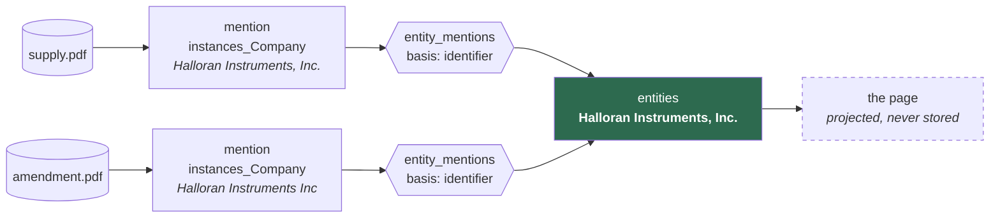

← [Back to index](index.md)

# Entities: the wiki

Everything up to this point was **mentions**. An `instances_Company` row is
document-scoped by construction: it records that *this document* named *this
company* at *this page*, with an excerpt and a review status. Two documents
naming one company are two rows, joined only by a key computed from the
spelling.

That is the right shape for "does this name appear elsewhere" and the wrong one
for "what do we know about this company" — which is the question a body of
knowledge has to answer if the next project is going to reuse it.

---

## An entity page is a projection, not a document



The page is computed from its mentions every time it is read. Nothing about a
company is stored on the entity row except its name and, optionally, prose a
person wrote. **So a claim with no mention behind it cannot appear on a page** —
not by convention, but because there is nowhere to put one.

That is the property that makes this reusable. A knowledge base of confident
uncited assertions is worth nothing downstream, and it is the default output of
every "AI builds you a wiki" tool. Here, every line points at a document, a
page, an excerpt, how well that excerpt matched the source, and whether a person
has checked it.

---

## Two tables

| Table | Holds |
|---|---|
| `entities` | The thing itself: `canonical_name`, `type_id`, a `description` a person wrote, review `status`, and `merged_into` |
| `entity_mentions` | Which mentions belong to it, on what `basis`, and whether a person has confirmed each link |

### `basis` is evidence, not a score

| Basis | What it means | Confidence |
|---|---|---|
| `human` | A person said so | `explicit` |
| `identifier` | A stated registration number matched exactly | `named` |
| `naive_key` | A normalised name matched exactly | `implied` |
| `similar` | Names close but not equal after normalising | `inferred` |
| `search` | A full-text hit | `inferred` |

These are different **kinds** of claim, not points on one scale, and collapsing
them would lose the distinction permanently. An exact company number is better
evidence than any spelling, however close — so `propose_entities()` groups on
identifiers first and falls back to names.

### `similar` catches what an exact key cannot

`naive_key` compares keys for **equality**, so a name that normalises
differently is invisible to it however obviously it is the same thing.
`"Ernst & Young"` and `"Ernst and Young"` is the documented case — the ampersand
becomes a space and the word does not, and no suffix rule fixes that.

`similar_names()` closes it with `rapidfuzz`, scoring `token_sort_ratio` over
lowercased names above a threshold of 80. That number is the midpoint of a
measured gap:

```
Halloran Instruments, Inc. / Halloran Instruments Inc   96.0  same
O'Sullivan Engineering     / OSullivan Engineering      97.7  same
MERIDIAN SYSTEMS LTD       / Meridian Systems Limited   90.9  same
Ernst & Young              / Ernst and Young            85.7  same
------------------------------------------------------- 80 --
Kestrel Medical Group      / Kestrel Medical Ltd        75.0  different
Kestrel Medical Group      / Kestrel Dental Group       63.4  different
CRH Group                  / CRH plc                    62.5  different
Halloran Instruments       / Halloran Group             47.1  different
```

Two things there had to be measured rather than assumed. **Case must be
normalised first** — on raw names that table overlaps catastrophically, with
`MERIDIAN SYSTEMS LTD` scoring 22.7 against its own expansion. And
**Jaro-Winkler is the wrong scorer**, despite being the obvious pick: it rates
`Kestrel Medical Group` against `Kestrel Medical Ltd` at 0.921, higher than
several true matches, so it would recreate the false merge that stripping
`group` as a suffix caused.

Ten hand-picked pairs is not a calibration. The threshold is a module setting
and a function argument for that reason, and it wants revisiting against a real
corpus.

It is optional (`pip install 'orpheus[match]'`). Without it, candidates come
from exact keys and stated identifiers only — which is what the rest of the
system rests on, so nothing breaks.

### The other half: two pages that are one thing

`similar_names()` helps a mention with no page. It cannot help the opposite
case, which is worse because it hides.

`propose_entities()` groups on exact keys, so `"Ernst & Young"` and `"Ernst and
Young"` become **two pages**. Every mention then has a home, so the review queue
is empty — the split is invisible exactly when the machine has finished its
work, and nothing prompts anyone to look.

`duplicate_pages()` closes that: same scorer, same threshold, run over the page
names rather than the mention names. It surfaces on the wiki's front page as
candidates for merging, with the page carrying more evidence offered as the
survivor. Found by running the thing, not by reasoning about it — a three-line
corpus produced four pages where three were right.

Neither function ever merges anything.

---

## Three rules carried over

**Nothing is destructive.** Unlinking a mention marks the row unlinked; it does
not delete it. A merged entity keeps its row and points at its successor, so a
link made before the merge still resolves and the merge is readable afterwards.
Both are evidence about how well matching works — the same reason a rejected
instance is kept.

**The machine proposes, a person decides.** Everything `propose_entities()`
creates is `unconfirmed`, and every page says so until a person has confirmed
both the page and each of its links. Splitting is deliberately *not* one
operation: unlink the mentions that belong elsewhere, then create the entity
they belong to, so each half is a decision with its own record.

**One mention has one home.** Enforced by a partial unique index rather than by
convention:

```sql
CREATE UNIQUE INDEX idx_entity_mentions_one_home
ON entity_mentions (instance_id) WHERE unlinked_at IS NULL
```

The same excerpt cited on two pages is two pages claiming the same evidence, and
nothing would notice. Partial, so an unlinked row does not block a relink.

---

## The page never picks a winner

When two documents disagree, both values come back, each with the mentions
asserting it and how many a person has confirmed:

```
what the documents say:
 * registration_number    482991                    2 mention(s)
   role                   supplier                  2 mention(s)
   role                   subcontractor             1 mention(s)
```

Choosing between them is a judgement, and making it in the projection would bury
it. Often both are true of the moment each document was written — a supplier in
2024 and a subcontractor in 2026 is a history, not a contradiction. The
disagreement is usually the interesting part.

*(Wikidata solves the same problem with statement **rank**, marking one value
preferred without deleting the others. That is the natural next step if a page
ever needs to state one current value; it is deliberately not built yet.)*

---

## Using it

```bash
orpheus --db data/orpheus.sqlite wiki propose --actor-id act_...
orpheus --db data/orpheus.sqlite wiki list
orpheus --db data/orpheus.sqlite wiki show ent_...
orpheus --db data/orpheus.sqlite wiki show ent_... --confirmed-only
```

In the browser, `/-/orpheus/wiki` is the front page: what needs doing, and the
actions. Browsing links to Datasette's own `entities` table, which is sortable,
searchable, faceted and exportable for nothing but a config block — so the index
is not rebuilt here. `/-/orpheus/wiki/<id>` is the page, `/-/orpheus/wiki/queue`
the work queue.

`--confirmed-only` is the collapsible half of the page: what the wiki *asserts*,
as against what it is *offering*. The default shows both, proposals included.

Over the API, on the same dispatch table as everything else:

| Method | Path | What it does |
|---|---|---|
| `POST` | `/entities/propose` | Group unlinked mentions into proposed pages |
| `GET` | `/entities` | The index; `?q=`, `?type_id=`, `?status=` |
| `GET` | `/entities/<id>` | The page; `?include_unconfirmed=0` for the tight view |
| `POST` | `/entities/<id>/confirm` · `/reject` · `/rename` · `/describe` | Review |
| `POST` | `/entities/<id>/merge` | `{"merge_id": …}` — two pages are one thing |
| `POST` | `/entities/<id>/mentions` | Link a mention |
| `POST` | `/entities/<id>/mentions/<iid>/confirm` · `/unlink` | Review one link |
| `GET` | `/entities/duplicates` | Pages that look like one thing |
| `GET` | `/mentions/unlinked` | The work queue |
| `GET` | `/mentions/<iid>/candidates` | Which pages this could belong to |
| `GET` | `/documents/<id>/entities` | The reverse view |
| `GET` | `/tensions/conflicts` · `POST /tensions/propose` | Where the page's sources disagree |

---

## When the sources disagree

A page never picks a winner. A property comes back as the set of values seen,
each with the mentions asserting it and how many a person has confirmed —
because choosing here would bury the judgement, and often both values were true
of the moment each document was written.

That is right, and on its own it is not enough. Two confirmed values rendered
one under the other in the same voice read as though they agree, and the reader
who needed to know they conflict is the one who will not notice. So a verified
conflict gets its own record: `entity_page()` returns `tensions` and
`contested_properties`, each mention carries the tensions it is a side of, and
the wiki renders them above the facts they are about rather than below.

`accepted` is a terminal state — *checked, and it stands* — which is what lets a
reviewer finish with the disagreement intact instead of picking a side to clear
the queue. See [Conflicts and lint](conflicts-and-lint.md).

---

## What this is not

It is not entity resolution. `naive_key` groups spellings and `registration_number`
groups exact identifiers; neither knows that *Halloran Instruments* and
*Halloran Group* are related, or that two companies sharing a name are not.
Every page built that way reports `resolution_quality: naive_unresolved` and
carries the caveat, until a person has confirmed the page and every link on it.

What it *does* provide is the shape real resolution would populate, and the
review surface that makes a person's decisions cheap to record. See
[`search.unextracted_mentions()`](developer-guide.md#searching-the-corpus) for
the neighbouring question: documents that name something with nothing extracted
from them at all, which no amount of linking can recover because there is no
mention there to link.

---

[← Back to index](index.md) | [Next: Conflicts and lint →](conflicts-and-lint.md)
