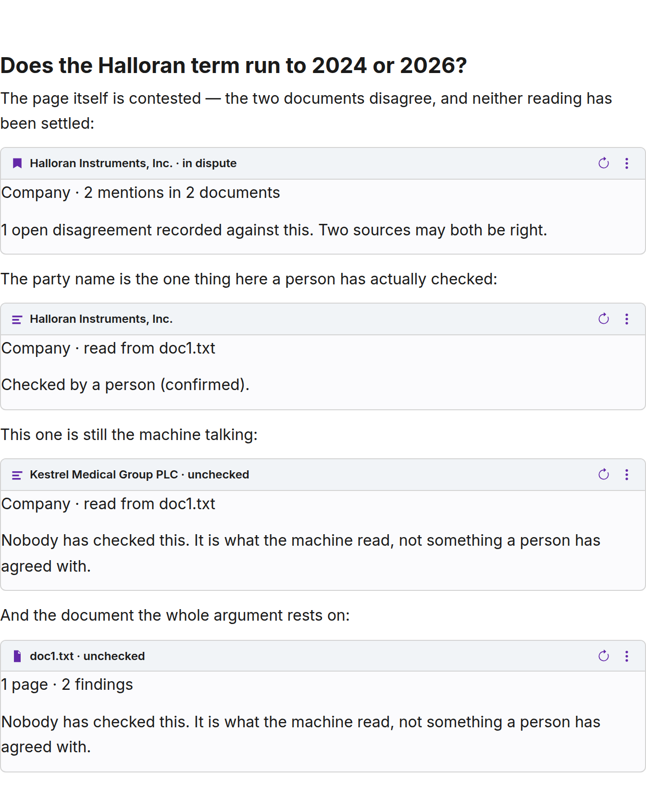
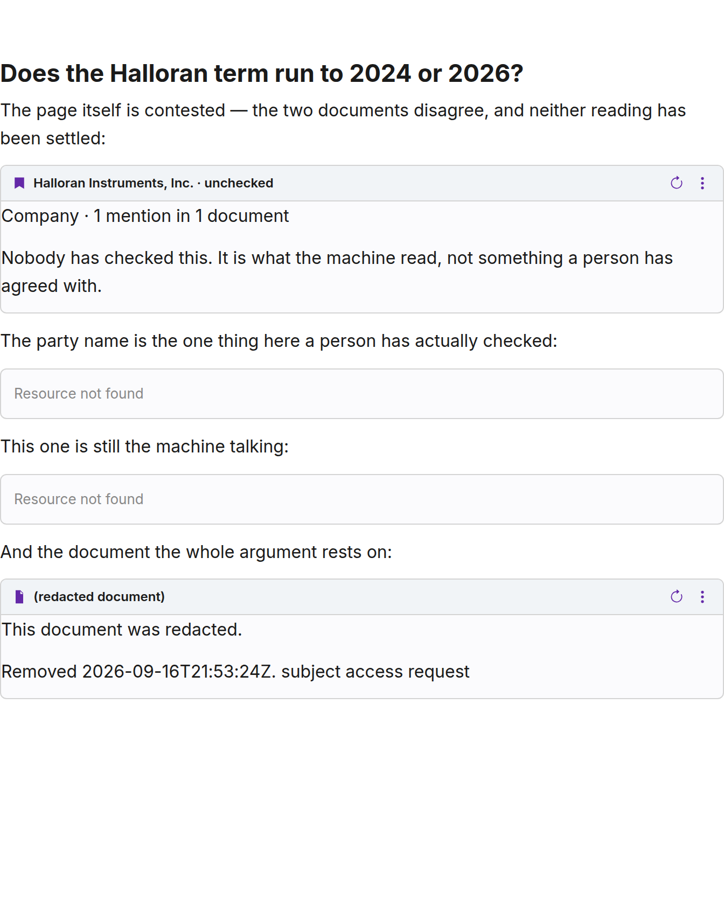

← [Back to index](index.md)

# A room for ideas, and a way to cite the corpus from it

A reviewer working through a corpus has thoughts that are not findings. A
half-formed argument. A note to come back to. A brief for somebody who has to
decide something on Thursday. None of that is an extracted fact, none of it
belongs in `instances_*`, and until now it had nowhere to live — so it lived in
email.

[`datasette-paper`](https://github.com/datasette/datasette-paper) is a mature
collaborative editor: rich text, tables, task lists, wiki links between papers,
per-paper sharing, a link graph. It gives ideas a room. What it cannot do on its
own is point at anything in the store — its wiki links go paper-to-paper, and it
has never heard of an `ent_`.

That is the whole of what Orpheus adds, and it is one plugin hook wide.

## Paste an Orpheus URL

`paper_embed_provider` lets a plugin claim a ref namespace and hand paper a
JavaScript bundle to render it. Orpheus claims `/-/orpheus/`, so **a URL you
already have open in another tab becomes a live reference when you paste it**.
There is no new syntax and nothing to learn.

Three shapes are claimed:

| Paste this | You get |
|---|---|
| `/-/orpheus/wiki/ent_…` | The wiki page |
| `/-/orpheus/document/doc_…` | The document |
| `/-/orpheus/ref/<any id>` | Anything, including a single extracted fact |

The third is a permalink added for this: everything in the store already has a
page, but they are at four shapes of URL and an extracted fact has none of its
own — it is an anchor on its document. `/-/orpheus/ref/<id>` is one form that
works for all of them and redirects to wherever the thing actually lives. The
`/` menu's Orpheus picker inserts it.

## Why a reference and not a link

A link is a string that was true once. Three things make these different, and
each is the reason there is a module rather than an `<a href>`.

### It carries the review state

This is the point. An extracted fact that nobody has checked is a machine's
guess. Quoted into a memo with nothing attached, it reads exactly like a fact
somebody verified — and a memo gets forwarded, and the caveat that was never
written down cannot travel with it. That is laundering, and preventing it is
what this whole project is for.

So every card says which it is, in the header line paper itself renders:



`Halloran Instruments, Inc. · in dispute`. `Kestrel Medical Group PLC ·
unchecked`. The confirmed one carries no suffix at all, which is deliberate: the
quiet case is the one where a person has ruled, and decorating it would train
readers to skip the decoration.

A contested page is **never** reported as checked, even when somebody confirmed
it, because an idea built on a contested reading has to show that it was
contested. The dispute wins.

### It is resolved now, not when it was written

The store moves. Here is the same brief, with not one word of its prose changed,
after the document it rests on was redacted:



The contested page lost its dispute and its confirmation, because both lived in
the document that went; it is down to one mention and is now unchecked. The two
facts read from that document resolve to nothing, because redaction deletes the
rows — they are *gone*, not hidden. The document itself is a tombstone carrying
the date and the reason, because its row was deliberately kept to say exactly
that.

Nothing cached this. A reference is a question asked at the moment somebody
reads it.

### It is resolved against the reader

Papers live in Datasette's internal database, where `auth.can()` never runs. So
the card is built per **viewer**, not per author: two people open the same memo
and the references to documents they may not see resolve to nothing.

"You may not see this" and "this does not exist" answer **identically**, because
telling them apart lets anybody enumerate the corpus by trying ids. That is the
rule `api.handle()` already keeps for a 403, kept here for the same reason.
`denied` and `not_found` carry no label, no detail and no href — there is one
construction site for a refusal in `orpheus/refs.py` and it has no way to put a
name on one.

The one exception is a redacted document, which is safe to distinguish because
its row exists to be found.

## What it will not do

**Papers are not part of the store.** They live in Datasette's internal
database. That means they are outside `edit_history`, outside `orpheus export`,
and — the one that matters — **outside the reach of `redact.py`**.

A reference to a redacted document breaks correctly, as the picture above
shows. A paragraph in which somebody *typed out* what that document said does
not. Redaction cannot reach it, because Orpheus does not own the prose.

That is not a bug to be fixed later; it is the shape of the arrangement, and a
deployment has to know it before it starts keeping notes rather than after. If
your notes will contain material a subject access request can reach, the
drafting space is not where that material should live.

**A note is never a finding.** Nothing written in a paper enters the store,
counts toward review, or moves extraction quality by a decimal. `orpheus report`
cannot see any of it. This is a room for arguing about the corpus, not a second
way to write to it — the ways to write to it are review, `record`, and the
suggestion queue, all of which are typed and all of which are audited.

**An entity page's name is visible to anyone signed in.** The wiki has never
been per-document permissioned — a page is a projection over mentions from many
documents — so an entity reference resolves for any actor, even one who cannot
read the documents behind it. That is a property of the wiki rather than of this
feature, but a drafting space makes it easier to reach, so it is stated here
rather than discovered.

## Setting it up

```
pip install 'orpheus[paper]'
```

Both halves register themselves: the hook when `datasette-paper` is installed,
the bundle route always. There is nothing to configure.

`/-/paper` is the index of papers; `/-/orpheus` is unchanged.

## How it is put together

| Piece | What it does |
|---|---|
| `orpheus/refs.py` | Resolves a ref to a card, per reader. The leak rule and the review vocabulary live here |
| `GET /refs/<id>` | One reference. Always 200 — the status is in the payload, so a dead citation is not a failed request |
| `POST /refs` | A page of prose at once, capped at 100, duplicates collapsed |
| `GET /refs?q=` | The picker, filtered by the asker |
| `plugins/orpheus_paper.py` | The hook. Describes the provider; never resolves anything |
| `plugins/paper/orpheus-embed.js` | The browser half: pill, card, picker |

Resolution happens **in the browser, with the viewer's own cookie**, which is
paper's contract for embed providers and is what makes the per-viewer rule real
rather than a claim this process makes about somebody else's session. The
backend never sees the paper.

The JavaScript is written by hand rather than built: one ES module, no imports,
and putting it through the Svelte/Vite pipeline would buy a content hash and
cost a build step on a file that changes once a year.

## What was measured

Run against a live Datasette with real `datasette-paper` (0.0.2a17):

- The provider reaches the editor page's lazy-load manifest:
  `{"kind": "orpheus-ref", "ref_prefixes": ["/-/orpheus/"], "js": ["/-/orpheus/paper/orpheus-embed.js"]}`.
- Four references render with four distinct review states; no console errors.
- After redacting the cited document, the same paper re-renders as the second
  picture — checked by reading the DOM, not by looking at it.
- Two bugs were found this way and only this way: every card matched twice in
  the DOM because the mount wrapper and the card shared a class, and a `Company`
  was rendering with a person icon.
- `datasette-paper` renders its own *"Resource not found"* chrome when `resolve`
  refuses, and never calls `mount` — so the refusal branches in the bundle are a
  narrow fallback for the race where the answer changes between the two calls,
  not the usual path.

`tests/e2e/paper_shots.py` is the script; it produced both pictures above.

---

[← Back to index](index.md)
