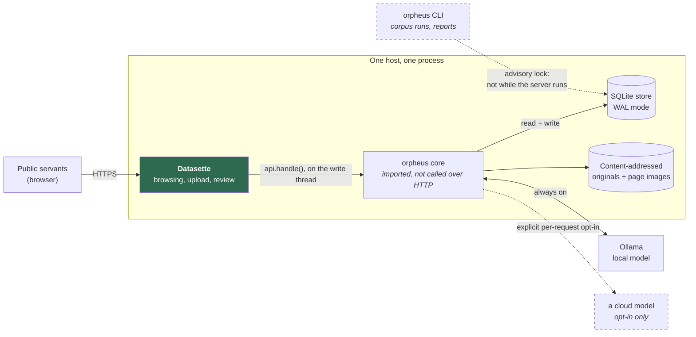

# Orpheus — Phase 1 documentation

Orpheus turns a document into structured, human-reviewable facts in an ontology
store, with enough provenance on every fact to know where it came from and
whether a person has checked it.

**The domain is the bundle.** The engine — ingest, classify, extract, review,
evaluate, compare — knows nothing about contracts. It is told which object type
a document is fundamentally about, and which property holds a comparable value,
by the bundle's `extensions.orpheus` block. The bundle shipped here describes
public-sector contracts because that is the driving use case and it makes the
documentation concrete; swapping it swaps the domain.

That claim used to assume somebody already had a bundle to swap in. A corpus
from a domain nobody has modelled has no type to file an answer under, and the
first bundle was always written by hand. `orpheus ontology survey` is that
missing step: it reads a sample of the corpus and proposes object types,
properties and links as a queue of candidates with located quotations, and a
person decides. It has been run on two corpora sharing nothing with contracts
— forty Python Enhancement Proposals, and forty-eight Steering Council
governance minutes — and the whole pipeline ran on the bundles it produced with
no code changes. `/-/orpheus/ontology` is where the queue is reviewed. See
[Where an ontology comes from](ontology.md) for what held and what did not.

This documentation covers **Phase 1**: ingest and extraction quality. The
reading companion was deferred once and is built — `/-/orpheus/read`, and the
same read as a batch job through `datasette-enrichments`. Conflict-of-interest
views are still out, and deliberately: the store has no notion of ownership,
directorships or donations, so a graph join would be an accusation drawn from a
join. See [Open decisions](open-decisions.md) for what is deferred and why.

Three things Phase 1 carries beyond extraction quality, each because leaving it
out would have made the wiki misleading rather than merely incomplete:

- **A verified disagreement has somewhere to live.** Every other review verb
  resolves towards a single answer, so without it two confirmed and
  contradictory facts render in the same voice and read as agreement. See
  [What falls due](calendar.md).
  [Two different pasts](two-pasts.md).
  [Conflicts and lint](conflicts-and-lint.md).
  [Redaction](redaction.md).
- **Agreement is counted in wordings, not rows.** Six call-off contracts
  carrying one framework's boilerplate is one source wearing six hats, and
  reporting it as six agreeing sources manufactures certainty out of
  duplication.
- **The corpus has a shape, and the shape says how much of itself it describes.**
  Entity resolution and the cross-document relation graph are in; both were
  previously deferred. See [Network and corroboration](network-and-corroboration.md).
- **A person and the machine can go through a document together.** The reading
  companion offers what a passage seems to hold, and nothing it offers is in the
  store until somebody says so — because proposals nobody asked for would
  otherwise pour into the number extraction quality is measured by. See
  [Reading with the machine](reading-companion.md).

---

## Contents

| Document | What it covers |
|---|---|
| [Where an ontology comes from](ontology.md) | Surveying a corpus that has no bundle yet — and why the machine proposes types but never authors them |
| [Data model](data-model.md) | Every table in the store, the ontology bundle, and the confidence rubric |
| [Pipeline walkthrough](pipeline-walkthrough.md) | Steps 1–9, in execution order, with the function that runs each |
| [Entities: the wiki](entities.md) | Mentions vs entities, and why a page is a projection rather than a document |
| [Reading with the machine](reading-companion.md) | A passage at a time, and why a suggestion is not an extraction |
| [Conflicts and lint](conflicts-and-lint.md) | The fourth review verb, the adversarial pass, and the markdown export |
| [Network and corroboration](network-and-corroboration.md) | The relation graph, counting agreement honestly, and what a budget is denominated in |
| [Questions the corpus raises](questions.md) | Where the shape is worth asking about — and why none of it is a finding |
| [Provenance and amendment](provenance-and-amendment.md) | The hardest part: how a machine guess becomes a checked fact, and how extraction quality gets measured |
| [API reference](api-reference.md) | Every route, its permissions, and its response shape |
| [Deployment](deployment.md) | Running it, and the WAL trap that catches people |
| [Developer guide](developer-guide.md) | Setup, tests, troubleshooting, project structure |
| [The corpus run](corpus-run.md) | What real models on real corpora found, and how to run one |
| [Open decisions](open-decisions.md) | What Phase 1 deliberately did not decide, and what the build corrected |
| [Prior art](prior-art.md) | Open-source tools that already do parts of this, and what that means |
| [Extraction engines](extraction-engines.md) | Choosing between a local encoder, LangExtract and a general LLM — and why the choice does not change what the data means |
| [Datasette ecosystem](datasette-ecosystem.md) | Four Datasette plugins, what each is worth here, and why the agent must not be the writer |
| [OCDS alignment](ocds-alignment.md) | Mapping the bundle onto the Open Contracting Data Standard |

---

## Where Orpheus sits



**Datasette is the single writer**, and the core is a library it imports rather
than a service it calls. That is not a convention: every write is queued through
Datasette's own write thread, the plugin writes no SQL of its own, and a second
*process* — the CLI, a script — is refused by an advisory lock. Read connections
reject writes before SQLite ever sees them.

---

## The pipeline in one sentence

A document is ingested and hashed, classified by a local model, populated into
per-object-type instance tables by an extraction engine plus a deterministic
date-and-money pass, evaluated against versioned rule concepts and an optional
narrative analysis, and every resulting fact is
correctable by a named person without anything being overwritten -- which is
also what makes extraction quality measurable rather than asserted.

---

## Quick start

```bash
pip install -e '.[server]'
```

```bash
orpheus --db data/orpheus.sqlite init --admin "Ada"
#   → creates the store, loads the bundle, sets up concepts and scores,
#     writes config/metadata.yml and config/datasette.yml, and prints the
#     command that serves what it just built

orpheus --db data/orpheus.sqlite ingest contract.pdf --actor-id act_... --extract
orpheus --db data/orpheus.sqlite report
```

Or as a library, with no server anywhere:

```python
from orpheus.store import Store
from orpheus import bundle, ingest, classify, extract, concepts

store = Store("data/orpheus.sqlite")
bundle.register(store, bundle.load())
bundle.apply_schema(store, bundle.load())

document_id = ingest.ingest(store, "contract.pdf", actor_id="act_...")["document_id"]
classify.classify(store, document_id, actor_id="act_...")
extract.extract(store, document_id, tier="local", actor_id="act_...")
concepts.evaluate_concepts(store, document_id, actor_id="act_...")

extract.document_instances(store, document_id)
store.close()
```

Serving it:

```bash
datasette serve data/orpheus.sqlite \
  --metadata config/metadata.yml \
  --config   config/datasette.yml \
  --plugins-dir plugins --template-dir templates --port 8001
```

Do **not** add `--immutable` to that command. It is the obvious flag for a
database you think nothing writes to, and it silently hides rows —
[Deployment](deployment.md#the-wal-and-immutable-mode-trap) explains why.

Both YAML files are generated by `orpheus config`. Datasette reads them through
different paths and they are not interchangeable: `--metadata` is descriptive
text and is the only one that reaches the rendered pages; `--config` carries the
`allow` blocks, the canned queries and the UI plugin's settings.

---

[Next: Data model →](data-model.md)
