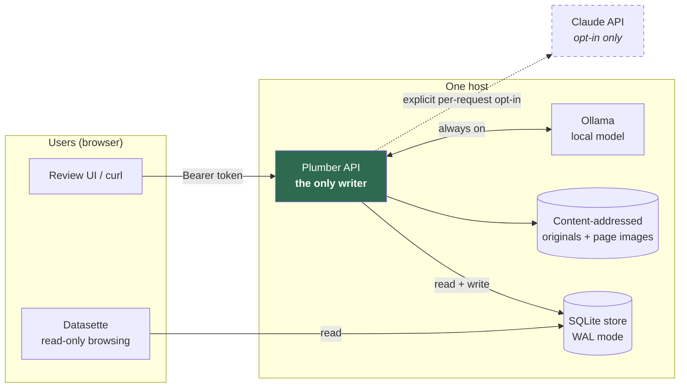

# Orpheus — Phase 1 documentation

Orpheus turns a contract document into structured, human-reviewable facts in an
ontology store, with enough provenance on every fact to know where it came from
and whether a person has checked it.

This documentation covers **Phase 1 only**: ingest and extraction quality.
Entity resolution, the cross-document relationship graph, conflict-of-interest
views and the live reading-companion UI are deliberately out of scope — see
[Open decisions](open-decisions.md) for what is deferred and why.

---

## Contents

| Document | What it covers |
|---|---|
| [Data model](data-model.md) | Every table in the store, the ontology bundle, and the confidence rubric |
| [Pipeline walkthrough](pipeline-walkthrough.md) | Steps 1–9, in execution order, with the function that runs each |
| [Provenance and amendment](provenance-and-amendment.md) | The hardest part: how a machine guess becomes a checked fact, and how extraction quality gets measured |
| [API reference](api-reference.md) | Every HTTP endpoint, its permissions, and its response shape |
| [Deployment](deployment.md) | Running the API and Datasette together, and the WAL trap that catches people |
| [Developer guide](developer-guide.md) | Setup, tests, troubleshooting, project structure |
| [Open decisions](open-decisions.md) | What Phase 1 deliberately did not decide, and what the build corrected |

---

## Where Orpheus sits



The **Plumber API is the single writer**. Datasette, and any future UI, are
read-only clients against the same SQLite file. That is not a convention: a
second writer is refused at startup by an advisory lock, and read connections
reject writes before SQLite ever sees them.

---

## The pipeline in one sentence

A document is ingested and hashed, classified by a local model, populated into
per-object-type instance tables by the `ontologyDiscoverR` flow plus a
deterministic date-and-money pass, evaluated against versioned `conceptR` rule
concepts and an optional narrative analysis, and every resulting fact is
correctable by a named person without anything being overwritten -- which is
also what makes extraction quality measurable rather than asserted.

---

## Quick start

```r
# install.packages(c("DBI", "RSQLite", "jsonlite", "digest", "rlang", "cli", "plumber"))
# remotes::install_github(c("CathalByrneGit/ontologyDiscoverR", "CathalByrneGit/conceptR"))
R CMD INSTALL .
```

```r
library(orpheus)

con   <- orph_init_store("data/orpheus.sqlite")   # migrations + the shipped bundle
admin <- orph_create_actor(con, "Ada", is_admin = TRUE)
token <- orph_create_token(con, admin, "cli")$token

doc <- orph_ingest(con, "contract.pdf", actor_id = admin)$document_id
orph_classify(con, doc, actor_id = admin)
orph_extract(con, doc, tier = "local", actor_id = admin)

orph_setup_concepts(con, actor_id = admin)
orph_evaluate_concepts(con, doc, actor_id = admin)

orph_document_instances(con, doc)
orph_disconnect(con)
```

Serving it:

```bash
ORPHEUS_DB=data/orpheus.sqlite Rscript inst/plumber/plumb.R      # writer, port 8000
datasette serve data/orpheus.sqlite \
  --metadata inst/datasette/metadata.yml --port 8001            # reader
```

Do **not** add `--immutable` to that Datasette command. It is the obvious flag
for a database this process never writes to, and it silently hides every row —
[Deployment](deployment.md#the-wal-and-immutable-mode-trap) explains why.

---

[Next: Data model →](data-model.md)
