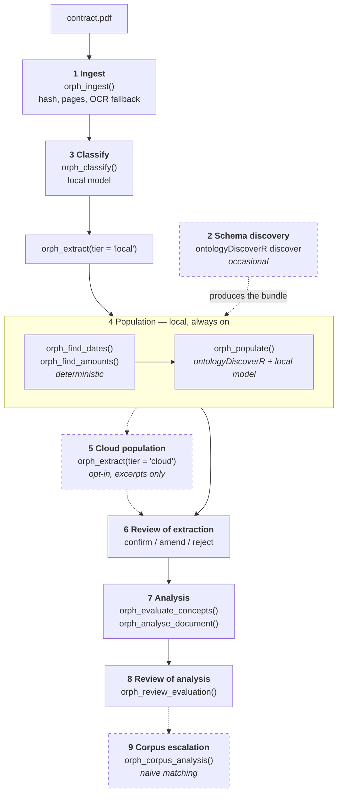

← [Back to index](index.md)

# Pipeline walkthrough

Nine steps from a file on disk to reviewed facts in the store. Steps 1, 3, 4 and
6 always run; 5, 7 and 9 are opt-in escalations a person triggers.

---

## 1 — Ingest

`orph_ingest(con, path, actor_id, storage_root, filename, visibility)`

Accepts PDF, `.docx`, plain text and images. The file is hashed with SHA-256 and
copied into a content-addressed store (`storage/documents/ab/abcd…pdf`), so an
extraction can always be re-run against exactly the bytes it came from.

Text extraction is per format:

| Format | Backend |
|---|---|
| PDF | `pdftools::pdf_text()`, falling back to the `pdftotext` binary |
| `.docx` | Pure R: the file is a zip, and `word/document.xml` holds the body |
| Plain text | Read directly; form feeds split pages |
| Image | Straight to OCR |

**Dedup is on content, not filename.** Re-ingesting identical bytes returns the
existing `document_id` with `duplicate = TRUE` rather than creating a second row.

**OCR is a provider, not a hardcoded tool** — which tool to use is still an open
decision. Any page yielding fewer than 40 characters is treated as image-only,
rendered to PNG, and passed to whatever `orph_ocr_provider()` returns: the
`tesseract` R package, a `tesseract` binary, or a function registered with
`orph_set_ocr_provider()`. With no provider available the page is recorded as
`text_source = 'needs_ocr'` — visible as a gap, rather than passed off as an
empty page.

Returns `document_id`, `n_pages`, `needs_ocr`, `text_source`.

## 2 — Schema discovery

Occasional, and not part of a document's journey. An `ontologyDiscoverR`
discovery session run over a sample of contracts produces a bundle via
`dis_to_bundle()`, reviewed with `dis_review()`, and registered with
`orph_register_bundle()`. Phase 1 ships a hand-seeded bundle so the pipeline
runs before anyone has done this.

## 3 — Classify

`orph_classify(con, document_id, actor_id, max_chars)`

Always the **local** tier. Classification reads the whole document, so routing it
to the cloud would mean sending every ingested document off-site to learn what it
is — the opposite of an opt-in.

Sets `doc_type` (`contract`, `amendment`, `tender`, `correspondence`, `other`),
`sector` and `jurisdiction`, with `classification_status = 'unconfirmed'`. The
prompt instructs the model to return `null` rather than guess a sector or
jurisdiction the text does not support.

## 4 — Population, local

`orph_extract(con, document_id, tier = "local", ...)`

Two passes, deterministic first.

**The deterministic pass** (`run_deterministic_pass()`) finds dates and monetary
amounts by pattern, per page. A date printed in the document is a fact about the
text, not a judgement, so it is recorded at the top of the rubric and the model
is left to do the work only it can do.

- `orph_find_dates()` handles ISO, `31 December 2024`, `December 31, 2024` and
  `31/12/2024`. Slash dates are read day-first, which is right for Irish, UK and
  EU documents and wrong for US ones — so an ambiguous one (both fields ≤ 12) is
  recorded at `0.5` with its raw text kept, rather than at `1.0` with a guess
  baked in.
- `orph_find_amounts()` handles symbols, ISO codes, and written-out currency. A
  currency read from a word (`500,000 euro`) scores `0.9`; one read from a code
  (`EUR 500,000`) scores `1.0`.
- `infer_role()` labels each finding from the **nearest** cue phrase, not the
  first one in the list. In *"Commencing on 1 January 2024 and shall expire on
  2026-12-31"* both cues are in range of both dates; nearest-cue is what makes
  the second one `end` rather than `start`.

**The model pass** calls `orph_populate()`, which hands an `ontologyDiscoverR`
`populate_session()` the whole schema and asks for instances and relationships.

## 5 — Population, cloud

`orph_extract(con, document_id, tier = "cloud", opt_in = TRUE)`

Same persistence path, `source = 'ai_cloud'`. Two independent conditions must
both hold — see [Provenance and amendment](provenance-and-amendment.md#the-cloud-gate).

By default only excerpts are sent: `orph_select_excerpts()` scores pages against
clause-related terms and sends the best few with their page markers intact, so
the model can still cite a page. `cloud_send_mode = 'full_document'` overrides
this deployment-wide.

## 6 — Review of extraction

`orph_confirm_instance()`, `orph_amend_instance()`, `orph_reject_instance()`,
`orph_review_edge()`, `orph_mark_document_reviewed()`.

Covered in full in [Provenance and amendment](provenance-and-amendment.md).

## 7 — Document-level analysis

Two different things wear this name, and they are kept apart because they fail
differently and want different review.

**Rule concepts** — `orph_evaluate_concepts()` runs `conceptR`'s versioned SQL
boolean expressions over the instance tables. Deterministic, reproducible,
diffable between versions. The six seed concepts are `high_value`,
`missing_signature`, `open_ended_term`, `direct_award`, `uncapped_liability` and
`auto_renewal`. A concept that comes out true raises a `Flag` instance, so a rule
finding sits in the same review queue as a model-raised one.

Two filters are applied that `conceptR` cannot apply itself, because it evaluates
a whole table: results are restricted to this document, and rejected rows are
excluded. A fact a reviewer threw out must not come back as a finding.

**Narrative analysis** — `orph_analyse_document()` gives a model the extracted
instances, with their confidence and status, and asks for a summary, risk level,
key issues and recommendations. It reads *structured facts, not document text*,
which keeps what goes to a cloud model to the facts a person has already seen.
Re-analysing supersedes the previous narrative rather than sitting beside it.

## 8 — Review of analysis

`orph_review_evaluation(con, evaluation_id, status, actor_id, result)` — the same
amendment model as instances. An amended evaluation becomes `source = 'human'` at
confidence `1.0`, with the original preserved in `edit_history`.

## 9 — Database-wide analysis

`orph_corpus_analysis(con, document_id, actor_id, narrate, tier, opt_in)`

A deliberate escalation, refused outright on a single-document store. It answers
the two questions Phase 1 can honestly answer without entity resolution: do the
companies and people here appear in other documents, and how does this contract's
value sit against others sharing a counterparty.

Matching is on `orph_naive_key()` — lowercase, punctuation stripped, company
suffixes dropped — and the lookup runs across every object type implementing the
`Named` interface, not just the type being asked about. A name that is a company
in one document and a person in another comes back as a `cross_type_match`,
reported separately because it is a weaker signal than a same-type hit. **Every result is labelled `resolution_quality =
"naive_unresolved"`** and carries a caveat naming the failure modes, because this
is a stepping stone to Phase 4 resolution rather than a substitute for it. Where
one key covers several spellings, `spelling_varies` is set: the clearest
available signal that real resolution is needed.

Values are compared only within a single currency. Converting them would need a
rate for the right date, which is not something to invent.

Uses `objectSetsR` when installed and falls back to direct SQL otherwise; the
result reports which via `engine`.

---

## What re-runs when

| Change | What re-runs |
|---|---|
| New document ingested | Steps 3–4 for that document only |
| `orph_extract()` called again for a tier that succeeded | Refused, unless `force = TRUE` |
| `orph_extract(force = TRUE)` | Unreviewed instances from that tier become `rejected`; confirmed and amended rows survive |
| An instance amended or rejected | Every evaluation that read it is marked `stale = 1` |
| A narrative analysis re-run | The previous one is marked stale and superseded |
| A concept's SQL changed in the bundle | `orph_setup_concepts()` adds a new version and deprecates the old; past evaluations keep pointing at the version that produced them |
| A schema amendment accepted | The bundle gains a property, its version bumps, and the column is added live |

Re-running a tier is refused by default because it would otherwise write a second
copy of every instance, leaving a reviewer to work out which of two identical
rows is current. `force = TRUE` supersedes rather than deletes: superseded rows
become `rejected` with a note in `edit_history`, staying queryable as evidence
about extraction quality.

---

[← Back to index](index.md) | [Next: Provenance and amendment →](provenance-and-amendment.md)
