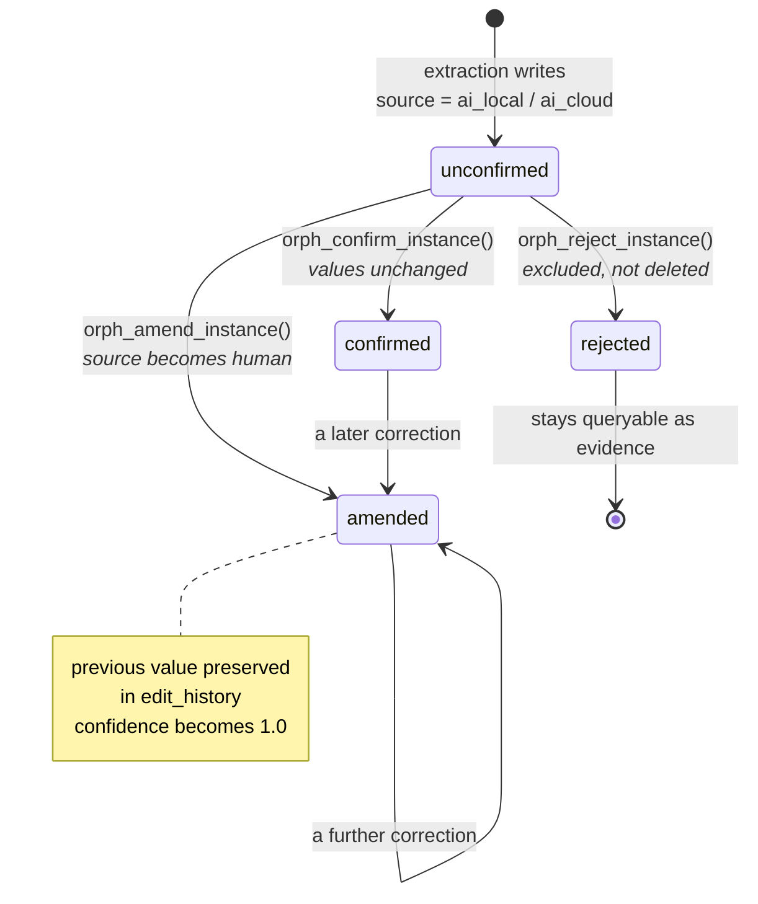
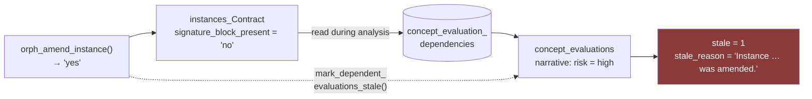

← [Back to index](index.md)

# Provenance and amendment

This is the part of Orpheus that everything else rests on. Extraction quality is
the whole point of Phase 1, and extraction quality is unmeasurable unless the
system remembers what the machine said, what the person changed it to, and who
that person was.

---

## The problem

An extraction pipeline that overwrites is a pipeline you cannot improve. If a
reviewer corrects "Meridian Systems Limited" to "Meridian Systems Ltd." and the
old value is gone, three things are lost at once:

- **The audit answer.** In a public-sector setting, "who changed this, when, and
  from what" is a question that will be asked.
- **The training signal.** Every correction is a labelled example of where
  extraction went wrong. Overwriting throws away the only dataset that could
  tell you whether the pipeline is getting better.
- **The trust signal.** A row that reads the same whether a model guessed it or a
  person verified it is a row nobody can rely on.

So nothing is destructively overwritten, and every fact says where it came from.

---

## The four states



Three deliberate choices in that diagram:

**Confirming does not change `source`.** The row stays `ai_local`; a person
agreeing with a machine does not make it a human observation. Only `status` and
`amended_by` change.

**Amending does change `source`, to `human`, at confidence `1.0`.** A human
correction is ground truth. Leaving the model's `0.7` in place would mean a
corrected row still read as a machine guess.

**Rejecting never deletes.** The row is excluded from `orph_document_instances()`,
from concept evaluation and from corpus matching, but it stays in the table. A
rejected extraction is evidence about extraction quality.

---

## The audit trail

Every mutation writes to `edit_history` **inside the same transaction as the
change it describes**, so a change and its audit row commit or roll back
together.

| Column | Meaning |
|---|---|
| `seq` | Monotonic. This, not `edited_at`, defines order |
| `table_name`, `row_id` | What changed |
| `document_id` | For document-scoped audit views |
| `action` | `ingest`, `classify`, `extract`, `confirm`, `amend`, `reject`, `superseded`, `evaluate`, `share_granted`, … |
| `previous_value`, `new_value` | JSON |
| `edited_by`, `edited_at`, `note` | Who, when, why |

`orph_row_history()` gives one row's story; `orph_document_history()` gives
everything that has happened to a document and to every instance extracted from
it — the view an auditor asks for.

> **Why `seq` and not a timestamp.** Timestamps are stored to the second, and
> several changes inside one transaction share one. Ordering an audit trail by a
> random identifier as a tiebreak means it reports events in an arbitrary order —
> precisely the question it exists to answer.

### The honest limitation

SQLite has no storage-level time travel. `edit_history` does that job at the
application level, which is a **weaker guarantee** than a snapshotting store
would give: a code path that forgot to log would be a hole a storage-layer
guarantee would not have. This is mitigated by routing every mutation through
`record_edit()` and letting nothing write to an instance table directly, but the
gap is real and understood rather than accidental. See
[Open decisions](open-decisions.md#storage-migration-to-ducklake).

---

## Two levels of review

The architecture left open whether review should be per-instance only or also
document-level. **Both are implemented**, because they answer different
questions.

| Level | Function | Question it answers |
|---|---|---|
| Per-instance | `orph_confirm_instance()` etc. | Has *this fact* been checked? |
| Per-document | `orph_mark_document_reviewed()` | Has anyone been through *the whole thing*? |

Marking a document reviewed **does not** confirm its instances. Conflating the
two would let one click silently promote every unchecked machine guess in the
document to `confirmed` — turning the review flag from a signal into noise.
Instead the result reports what is still outstanding:

```r
orph_mark_document_reviewed(con, doc, actor_id = "act_nuala")
#> $review_status         "reviewed"
#> $unconfirmed_instances 6
#> $note                  "Marked reviewed with 6 instance(s) still unconfirmed."
```

`orph_review_progress()` gives the counts by status at any time.

---

## Schema amendments

When population produces a property the bundle does not declare, it is **not
dropped**. Silently discarding it would lose exactly the signal that tells you
the schema is wrong. It becomes a candidate in `schema_amendments`.

This happens in two places, deliberately: the engine flags what it noticed, and
`insert_instance()` flags anything undeclared regardless of what the engine
said. A property cannot reach an instance table without either being declared or
being queued.

| Amendment type | Raised when | Accepting it |
|---|---|---|
| `new_property` | A property is not declared on a known type | Adds the property to the bundle, bumps the patch version, adds the column live |
| `new_type` | An object type is not in the bundle | Recorded only |
| `new_link_type` | A link type is not in the bundle | Recorded only |

Repeat sightings **increment `occurrences`** rather than queueing duplicates: a
property appearing in forty contracts is one decision, and its frequency is the
strongest argument for accepting it. The queue is sorted by `occurrences`
descending.

`new_type` and `new_link_type` are not auto-applied. A new object type needs
properties, keys and a place in the model that only a person can decide;
accepting one records the decision and leaves the bundle edit deliberate.

**Deciding an amendment is an administrator action**, not an ordinary review:

```r
orph_review_schema_amendment(con, id, "accepted", actor_id = "act_admin")
#> $applied_to_bundle TRUE
#> $bundle_version    "0.1.1"
```

Accepting one changes the bundle for every document, not one row. The API
enforces this with a 403 for non-admin actors.

---

## Staleness

An interpretation built on a fact that has since changed is not wrong so much as
out of date — and the difference matters, because silently stale is worse than
visibly stale.

`concept_evaluation_dependencies` records which instances each evaluation
actually read. Amending or rejecting any of them calls
`mark_dependent_evaluations_stale()`, which sets `stale = 1` and a
`stale_reason` on every evaluation that depended on it.



Without the dependency table, `stale` could only ever be set by hand. With it,
the Datasette `stale_evaluations` query is a live worklist of analyses that need
re-running.

---

## The cloud gate

Cloud processing is opt-in, and an opt-in nobody can audit afterwards is a
formality. Two independent conditions must both hold before any text leaves the
building:

| Condition | Where it lives | Values |
|---|---|---|
| Org policy allows it at all | `org_settings.cloud_ai_policy` | `disabled` (default), `per_user`, `org_allow` |
| This request explicitly asked | `opt_in` / `cloud_opt_in` | must be `TRUE` |

**The default is `disabled`.** A deployment handling sensitive contract data
should have to turn cloud processing on deliberately, not discover it was on.
Whether the toggle belongs to each user or to the organisation is an open
question, so both policies exist and neither is assumed — see
[Open decisions](open-decisions.md#cloud-ai-opt-in-policy).

**Policy alone never authorises a call.** Even under `org_allow`, a request
without `opt_in = TRUE` is refused. That is what stops cloud becoming a silent
default the moment an administrator relaxes the policy.

The gate is checked *before* any document text is prepared, so a blocked request
sends nothing and logs nothing.

### The audit log

Every call — local and cloud, success and failure — is written to `llm_calls`:

| Recorded | Not recorded |
|---|---|
| tier, provider, model, purpose | the prompt text |
| `prompt_chars`, `excerpt_only` | the document content |
| SHA-256 `payload_digest` | |
| `actor_id`, `document_id`, `created_at`, `error` | |

The digest is enough to prove what left the building without storing the
contract text a second time. The `cloud_calls` canned query in Datasette is the
administrator's view of it.

---

[← Back to index](index.md) | [Next: API reference →](api-reference.md)
