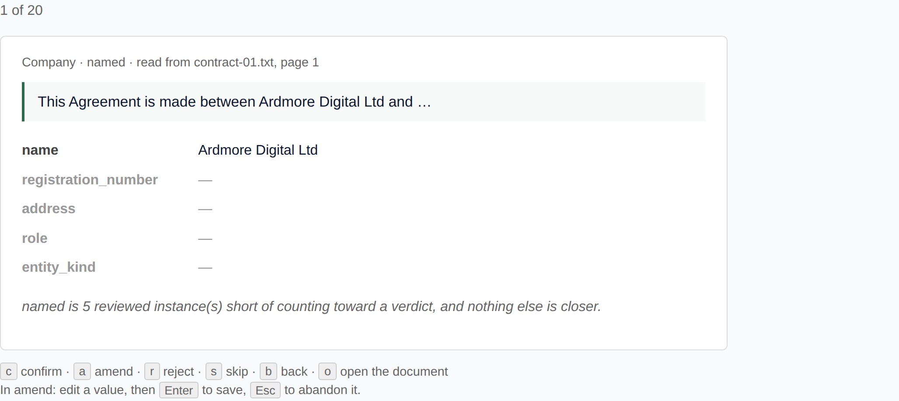

← [Back to index](index.md)

# Reviewing a corpus without it being an ordeal

Everything Orpheus claims about quality is downstream of somebody having
reviewed some of it. `orpheus report` answers `insufficient_evidence` until two
confidence levels each hold five reviewed instances, and no amount of machinery
moves that number — only a person does.

So the constraint on this whole system is **human minutes**, and until now
nothing had been built to reduce them.

## What reviewing cost before

The document page can review: it renders every extracted row with a form beside
it. But the form posts and redirects back to the document page, so **every
decision costs a full page load of every row on that document** — and before
that, somebody has to decide which document to open.

Measured, rather than asserted. `tests/e2e/measure_review.py` confirms the same
twenty findings both ways against a live server, on identical freshly built
stores, and checks the store afterwards:

```
  document pages
    decisions     20  (store agrees: 20)
    page loads    25
    total         14.9s
    per decision  0.58s (median 0.58s)

  the review queue
    decisions     20  (store agrees: 20)
    page loads    1
    total         1.3s
    per decision  0.03s (median 0.03s)
```

**11.6x, on 25 page loads against 1.**

Read that as a floor rather than a headline. It is a local server with no
network latency, on documents holding five findings each. On a real deployment
the document-page arm gets worse — the reload renders every row, so a document
with forty findings pays for forty on every decision — while the queue stays
flat. And 0.58s is the *overhead the tool imposes*; a person's actual thinking
time sits on top of both numbers. What is being measured is how much of the
reviewer's attention the software takes for itself.

## The queue

`/-/orpheus/review/queue`, or **Review queue** in the menu.



Three things are different, and each is one of the reasons the document page is
slow:

**The ranking chooses, not the reader.** The cards are `triage()`'s queue, so
the first card is the review that gets the report closest to speaking — and the
card says why, in the line under the values. A reviewer never scrolls looking
for something worth doing.

**The evidence comes with the card.** The excerpt, the page number and every
amendable value arrive in one payload. Deciding whether a value is right means
seeing the sentence it was read from, and fetching that one page-load at a time
is most of what made reviewing slow.

**A decision does not reload the page.** The verbs post in the background and
the next card is already rendered.

| Key | |
|---|---|
| <kbd>c</kbd> | confirm — the machine's value is right |
| <kbd>a</kbd> | amend — edit the values, <kbd>Enter</kbd> to save, <kbd>Esc</kbd> to abandon |
| <kbd>r</kbd> | reject — this is not a real finding |
| <kbd>s</kbd> | skip, without deciding |
| <kbd>b</kbd> | back to the previous card |
| <kbd>o</kbd> | open the document in a new tab |

The keys are printed on the page. A queue whose speed depends on shortcuts
nobody knows about is a queue nobody gets through quickly.

## What it refuses to do

**It does not count a decision the store refused.** The tally moves and the
card advances only after the write comes back. A counter that moved on the
keypress would be a count of keystrokes, and the reviewer would come to believe
they had reviewed something they had not. A refusal keeps you on the card with
the reason.

**It does not offer an undo.** There isn't one, and inventing the word would be
a lie: nothing in this store is destructively overwritten, so there is no
un-reviewing. What there is instead is <kbd>b</kbd>, which takes you back to a
card you have already decided and lets you decide it again. That records a
**second decision**, the first one stays in `edit_history`, and the card says so
before you press anything.

**It does not offer a box for a value it would overwrite.** `naive_key` is
recomputed from `name` whenever a name is amended, so editing it directly is an
edit that disappears. `DERIVED_PROPS` in `orpheus/review.py` names the one such
property there is today and says where the recomputing happens. The bundle has
no way to declare a property derived; if that list ever grows past one entry, it
belongs there instead of in the code.

**It does not offer work you cannot do.** The cards are filtered on `edit`, not
`view` — a viewer can read a shared document and cannot amend a row in it, and a
card whose verb gets refused wastes the thing the queue exists to save. When
cards are held back for that reason it says so and counts them, because a queue
that hands back three cards from a corpus of nine hundred unreviewed rows is
either nearly finished or a permission boundary, and a reviewer cannot tell
those apart unless it says which.

This is also what makes the corpus-wide queue useful to somebody who is not an
administrator — the usual case, since reviewing is the job and administering is
not. `/review/triage` is administrator-only corpus-wide because it spans
documents you may not read; `/review/queue` spans only the ones you may correct,
which is a narrower set and needs no such gate.

**It does not hide an empty value.** A property with nothing extracted is shown
greyed rather than dropped. A reviewer correcting a row needs to see the box
that is empty, and hiding it would make *"nothing was extracted"* look like
*"nothing exists"* — which is the distinction the rest of this project spends
most of its effort on.

## A batch, re-ranked

Twenty cards at a time, and the button at the end says *"Next batch"* rather
than *"Next page"* — because it is not one. The ranking is computed from what
has been reviewed, so five reviews at a level can push it over the line and make
a different level the shortest way to an answer. A long page of cards would be
stale by the time it was halfway read.

If you decided nothing, it says so and offers a reload instead: the next batch
would be the same one.

## Doing it from somewhere else

`GET /-/orpheus/api/review/queue` is the same payload the page embeds —
`?document_id=` to scope it, `?limit=` to change the batch. Every decision goes
through the same `POST /instances/<id>/{confirm,amend,reject}` the document
page's forms post to, so this is not a second write path; the only difference is
that the page does not reload between decisions.

`orpheus triage` remains the terminal view of the ranking, without the evidence
attached.

---

[← Back to index](index.md)
